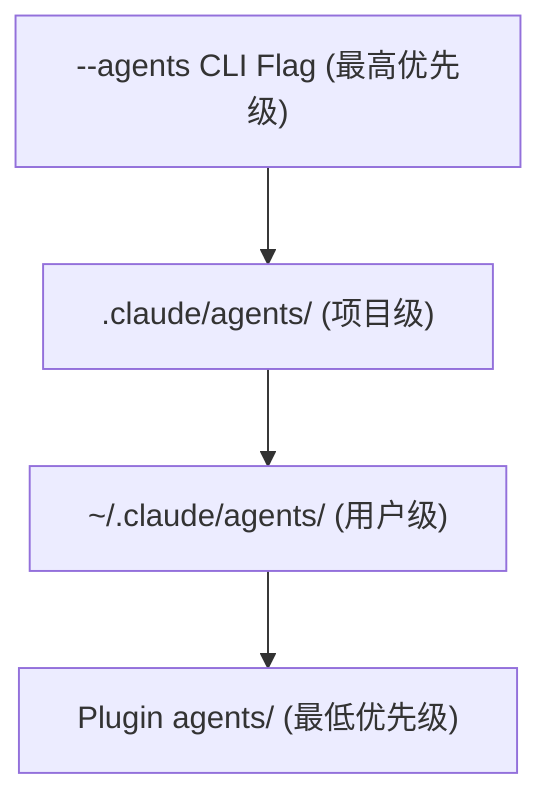

---
AIGC:
    Label: "1"
    ContentProducer: 001191440300708461136T1XGW3
    ProduceID: cf54d54c59baa0ada35a5ecb7c73a584_788e0f77685111f1a99c5254007bceed
    ReservedCode1: thwF5kmfGlS3P4oIXA3x6Xi/zwAd4QN9G7odZHAXWB1nj/eZbaLOaIP7d+5+nt1mIWHCyHYsyAOsYL2uowkglCAbzq3OtkLGvNgcFGg9IZJz4LVIT6eWchitfMfUzL28a5idtbCzRXXKUBaHTmlGsIUnRFhFtno0/thMyHwFLNzASfDR/D3uzUU2v/I=
    ContentPropagator: 001191440300708461136T1XGW3
    PropagateID: cf54d54c59baa0ada35a5ecb7c73a584_788e0f77685111f1a99c5254007bceed
    ReservedCode2: thwF5kmfGlS3P4oIXA3x6Xi/zwAd4QN9G7odZHAXWB1nj/eZbaLOaIP7d+5+nt1mIWHCyHYsyAOsYL2uowkglCAbzq3OtkLGvNgcFGg9IZJz4LVIT6eWchitfMfUzL28a5idtbCzRXXKUBaHTmlGsIUnRFhFtno0/thMyHwFLNzASfDR/D3uzUU2v/I=
---

# AGENTS.md — 子代理管理与自动化配置

> 基于 Anthropic 官方课程（Subagents / Agent Skills / Claude Code）提炼
> 更新：2026-06-16 第三轮循环

---

## 一、子代理目录结构

```
项目根目录/
├── CLAUDE.md                    # 主配置：定义所有子代理
├── .claude/
│   ├── subagents/               # 子代理定义
│   │   ├── code-reviewer.md     # 代码审查子代理
│   │   ├── doc-writer.md        # 文档撰写子代理
│   │   ├── test-generator.md    # 测试生成子代理
│   │   └── security-auditor.md  # 安全审计子代理
│   ├── skills/                  # Skills 技能库
│   │   ├── code-review/SKILL.md
│   │   ├── api-design/SKILL.md
│   │   └── doc-writer/SKILL.md
│   ├── hooks/                   # Hooks 事件处理
│   │   ├── pre-commit.md
│   │   ├── security-check.md
│   │   └── session-init.md
│   └── mcp/                     # MCP 服务配置
│       └── mcp-config.json
```

---

## 二、子代理配置规范

### CLAUDE.md 子代理定义
```markdown
## Subagents

### code-reviewer
- **Purpose**: Review code changes for quality, security, and best practices
- **Trigger**: When code is modified or PR is submitted
- **Context**: Full diff of changed files
- **Output**: Review report with severity levels (critical/high/medium/low)
- **Constraints**: Read-only access to codebase, no file modifications

### doc-writer
- **Purpose**: Generate and update project documentation
- **Trigger**: When new features are implemented or API changes occur
- **Context**: Source code and existing docs
- **Output**: Updated documentation in markdown format
- **Constraints**: Write access limited to docs/ directory

### test-generator
- **Purpose**: Generate unit and integration tests
- **Trigger**: When new code is written
- **Context**: Source code and test framework config
- **Output**: Test files in tests/ directory
- **Constraints**: Write access limited to tests/ directory
```

### 子代理规范模板

每个子代理定义文件应包含：

```markdown
# [子代理名称]

## 角色
[一句话描述子代理职责]

## 触发条件
[何时创建此子代理]

## 上下文范围
[子代理可访问的文件/目录/数据范围]

## 工具权限
| 工具 | 权限 | 说明 |
|------|------|------|
| read_file | ✅ 允许 | 读取源代码 |
| write_file | ❌ 禁止 | 不可修改文件 |
| shell_executor | ⚠️ 受限 | 仅测试命令 |

## 输出规范
[子代理输出格式与位置]

## 故障处理
[超时/异常/错误时的行为]
```

---

## 三、权限矩阵

### 三级权限模型

| 级别 | 能力 | 适用子代理 |
|------|------|-----------|
| Observer | 只读（read/search/list） | code-reviewer, security-auditor |
| Contributor | 限定写（指定目录） | doc-writer, test-generator |
| Operator | 全权（需人工确认） | 部署代理、迁移代理 |

### 权限继承规则
- 子代理权限 ≤ 主 Agent 权限
- 子代理不可请求提升权限
- 子代理不可修改自身权限配置
- MCP 工具权限需显式声明

### 危险操作清单（子代理禁止）

| 操作 | 原因 |
|------|------|
| 修改 CLAUDE.md | 防止自修改 |
| 删除 .claude/ 目录 | 防止破坏配置 |
| 修改 MCP 配置 | 防止权限提升 |
| 网络请求（未授权域） | 防止数据泄露 |
| 读取 .env / .ssh | 防止凭据窃取 |
| 执行系统级命令 | 防止宿主机入侵 |

---

## 四、Hooks 自动化配置

### 推荐 Hooks 清单

```markdown
## Hooks

### PreToolUse: Security Check
**事件**: 任何写入/删除操作前
**行为**: 验证路径白名单、检查文件类型
**失败**: 阻止操作 + 通知用户

### PostToolUse: Audit Log
**事件**: 任何工具调用后
**行为**: 记录（工具名、参数、结果、时间戳）
**输出**: .claude/audit.log

### OnSessionStart: Context Init
**事件**: 会话开始时
**行为**: 加载项目 CLAUDE.md、检查更新
**失败**: 降级为最小上下文模式

### OnError: Graceful Degradation
**事件**: 任何异常发生时
**行为**: 记录错误 → 尝试降级 → 通知用户
**降级策略**: 子代理失败 → 主 Agent 接管 / API 失败 → 本地缓存
```

---

## 五、团队规模模板

### Solo 开发者（1人）
```
主 Agent (Claude Code)
├── Skills: 2-5 个（代码审查、文档、测试）
├── Hooks: 2-3 个（安全、格式化、提交前检查）
├── Subagents: 0-1 个（大规模重构时临时创建）
└── MCP: 1-2 个（数据库、文件系统）
```

### 小团队（2-5人）
```
主 Agent (Claude Code + CI 集成)
├── Skills: 5-10 个（多领域覆盖）
├── Hooks: 5-8 个（代码审查、CI 集成、部署检查）
├── Subagents: 2-3 个（code-reviewer / test-generator / doc-writer）
└── MCP: 3-5 个（数据库、文件系统、CI/CD、通知、监控）
```

### 中大型组织（10+人）
```
Agent 编排层 (Claude API + 自建平台)
├── Skills: 20+ 个（企业级模板库）
├── Hooks: 完整治理框架
├── Subagents: 按领域划分（前端/后端/数据/安全/运维）
├── MCP: 全集成（所有内部系统）
└── 认证：Claude Certified Architect + 企业治理
```

---

## 六、MCP 最小化原则

### 仅注册必要服务
```json
// ❌ 错误：过度注册
{"mcpServers": {"everything": {...}}}

// ✅ 正确：按需注册
{"mcpServers": {
  "project-db": {"command": "..."},
  "project-fs": {"command": "..."}
}}
```

### MCP 安全规则
- 每个 MCP Server 独立进程运行
- 网络隔离：仅允许预定义端点
- 敏感数据脱敏后再传递给 Claude
- 定期轮换认证凭证

---

## 七、自动化派发规则

### 任务 → 子代理映射

| 任务类型 | 目标子代理 | 并行度 |
|---------|-----------|--------|
| 代码审查 | code-reviewer | 并行（按文件） |
| 文档更新 | doc-writer | 串行（避免冲突） |
| 测试生成 | test-generator | 并行（按模块） |
| 安全审计 | security-auditor | 串行（全量扫描） |
| 多语言翻译 | translator-N | 并行（按语言） |
| 数据迁移 | migration-agent | 串行（阶段依赖） |

### 派发决策算法
```
function dispatch(task):
    if task.type in PARALLEL_SAFE:
        create N subagents → parallel execute
    elif task.type has DEPENDENCIES:
        for each stage in dependency_order:
            create 1 subagent → execute → verify → next stage
    elif task.complexity <= SINGLE_FILE:
        handle directly（no subagent needed）
    else:
        create 1 subagent → execute → return result
```

---

> 管理哲学：子代理是工具，不是替代品。配置的目的不是让主 Agent 退位，而是让它在正确的层级上做正确的决策。
> 来源：Anthropic Academy Subagents/Agent Skills/Claude Code 课程 + 认证考试考试纲要
*（内容由AI生成，仅供参考）*

---

## 八、基于五种协调模式的派发决策优化（2026-06-15 第3轮更新）

> 来源：Anthropic 官方博客 Multi-agent coordination patterns (2026-04-10)

### 8.1 五种模式下的子代理配置差异

| 配置维度 | Orchestrator-Subagent | Agent Teams | Message Bus | Shared State |
|---------|----------------------|-------------|-------------|--------------|
| 子代理生命周期 | 单次任务→终止 | 跨多次任务存活 | 事件驱动存活 | 持续存活 |
| 上下文管理 | 每次重建 | 累积持久化 | 事件携带+自身 | 从存储自取 |
| 权限边界 | 编排器显式声明 | 队友自声明 | 订阅即权限 | 存储读写即权限 |
| 故障隔离 | 编排器不传播 | 队友间隔离 | 路由不传播 | 无隔离保障 |
| 发现机制 | 编排器预定义 | 协调器分配 | Pub/Sub 匹配 | 存储自检索 |
| 协调复杂度 | 低（集中式） | 中（队列式） | 高（事件式） | 最高（无协调） |

### 8.2 龙虾 dispatch_task 五模式扩展映射

```
dispatch_task 当前实现 → Orchestrator-Subagent (主要) + Agent Teams (继承模式)

扩展方向：
├── Generator-Verifier 模式
│   └── 派发验证子代理 + 反馈循环 + 最大迭代控制
│   └── 配置：verifier_agent + max_iterations + fallback_strategy
│
├── Agent Teams 增强
│   └── inherit_agent_id 实现队友持久化 + 任务队列认领
│   └── 配置：teammate_pool_size + task_queue + completion_signal
│
├── Message Bus（协议#251）
│   └── 事件发布/订阅 + Router 投递 + Agent 动态注册
│   └── 配置：event_topics + subscription_rules + router_config
│
└── Shared State（协议#247+#248）
    └── SQLite 持久化看板 + Agent 自检索 + 终止条件
    └── 配置：shared_store_path + termination_policy + write_conflict_resolution
```

### 8.3 按模式优化的自动化配置模板

#### Generator-Verifier 配置
```yaml
subagent:
  name: quality-verifier
  mode: generator-verifier
  max_iterations: 3
  fallback: escalate_to_user
  verify_criteria:
    - accuracy_check
    - tone_check
    - completeness_check
```

#### Agent Teams 配置
```yaml
team:
  name: migration-squad
  mode: agent-teams
  pool_size: 4
  task_queue: shared
  completion_signal: all_done
  conflict_resolution: locking
```

#### Message Bus 配置
```yaml
bus:
  name: event-bus
  mode: message-bus
  router: semantic_llm
  topics:
    - security.alerts
    - code.reviews
    - docs.updates
  agent_registry: dynamic
```

#### Shared State 配置
```yaml
shared_state:
  name: research-kb
  mode: shared-state
  store: sqlite
  termination:
    type: convergence
    threshold: 3_cycles_no_new_findings
  write_policy: append_only
  conflict: versioning
```

### 8.4 派发决策算法 v2.0（五种模式全覆盖）

```
function dispatch_v2(task):
    # 1. 质量验证模式判定
    if task.requires_quality_check AND has_explicit_criteria(task):
        return generator_verifier(task)

    # 2. 复杂度判定
    if task.complexity <= SINGLE_FILE:
        return handle_directly(task)

    # 3. 可分解性判定
    if has_clear_decomposition(task):
        if subtasks_short_and_independent(task):
            return orchestrator_subagent(task)  # 当前主线
        elif subtasks_benefit_from_context(task):
            return agent_teams(task)             # inherit_agent_id

    # 4. 松耦合生态判定
    if workflow_unpredictable(task) OR agent_ecosystem_growing(task):
        return message_bus(task)                 # 协议#251

    # 5. 协同构建判定
    if needs_mutual_discovery(task) OR eliminate_single_point(task):
        return shared_state(task)                # 协议#247+#248

    # 6. 兜底
    return orchestrator_subagent(task)
```

### 8.5 安全护栏：模式无关的通用约束

无论选择哪种协调模式，以下约束不可覆盖：

| 约束 | 所有模式强制 | 原因 |
|------|:---:|------|
| 子代理不可修改主配置 | ✅ | 防自修改攻击 |
| 子代理不可提升自身权限 | ✅ | 防权限蔓延 |
| MCP 权限需显式声明 | ✅ | 防影子依赖 |
| 危险操作路径白名单 | ✅ | 防越权访问 |
| Hooks 在所有模式生效 | ✅ | 统一安全层 |
| 敏感凭据不传递子代理 | ✅ | 防凭据泄漏 |

---

## 九、Dynamic Workflows 配置与派发（第4轮学习·R86新增）

> **来源**：Anthropic Claude Code Docs "Workflows" (2026)

### 9.1 Workflow 脚本配置模板

```yaml
# .claude/workflows/codebase-audit.yaml (项目级)
name: codebase-audit
description: "大规模代码审计——并行扫描所有API端点的认证检查"
trigger: "ultracode: audit every API endpoint"
phases:
  - name: enumerate_endpoints
    model: haiku_4.5         # 轻量模型扫描
    agents: 10
    task: "扫描 src/routes/ 下所有文件，列出每个API端点及其认证机制"
    
  - name: audit_parallel
    model: sonnet_4.5        # 审查用中等模型
    agents: 16               # 最大并发
    task: "逐端点检查: 是否有认证中间件? 是否有角色检查? 是否有输入验证?"
    
  - name: cross_verify
    model: opus_4.5          # 交叉验证用最强模型
    agents: 5
    task: "对比 audit_parallel 结果，驳斥至少一个其他Agent的发现，仅保留多源一致的漏洞"
    
  - name: synthesize_report
    model: opus_4.5
    agents: 1
    task: "汇总所有确认的漏洞，按严重性排序，生成修复建议"
```

### 9.2 派发算法 v3.0：三阶梯选择

```
用户任务 → 规模评估
│
├─ TIER 1: <10 子代理，<30分钟 → dispatch_task (传统)
│   └─ 五模式选择决策树（第8节 v2.0 算法）
│     - 有效: memory_ids, inherit_agent_id, 并行≤5
│
├─ TIER 2: 10-100 子代理，小时级 → 生成 Workflow 脚本
│   └─ 运行: ultracode 关键词或 /effort ultracode
│     - 子代理: acceptEdits 模式，继承工具白名单
│     - 保存: 同会话可 /workflows 面板暂停/恢复
│
└─ TIER 3: 100-1000 子代理，天级 → 持久化 Workflow
    └─ 保存: `s` 键保存为 /command
      - .claude/workflows/ (项目级, 团队共享)
      - ~/.claude/workflows/ (个人级, 全局可用)
      - 入参: args 参数传递（如 /triage-issues 1024, 1025, 1030）
```

### 9.3 Workflow 安全护栏

| 规则 | 说明 |
|------|------|
| **子代理不可交互** | 运行中不接受用户输入（仅权限提示可暂停） |
| **子代理 = acceptEdits** | 强制，不受会话权限模式影响 |
| **工具白名单继承** | 子代理继承你的 allowlist，未列的工具会弹窗中断 |
| **无文件系统直访** | Workflow 脚本本身不能直接读/写文件或执行 Shell——由 Agent 执行 |
| **16 并发 / 1000 Agent 上限** | 运行时约束，防止资源耗尽 |
| **不跨会话恢复** | 退出 Claude Code 后运行不可恢复——重新开始时从头执行 |

### 9.4 与现有 AGENTS.md 配置的关系

| 现有能力 | Workflow 中的对应 |
|---------|----------------|
| dispatch_task (v2.0 五模式) | 脚本内多 Phase 并行派发 → TIER 2-3 |
| 子代理权限模型 (Observer/Contributor/Operator) | Workflow 子代理 = acceptEdits（等价 Contributor） |
| Hooks 审计 | PreToolUse/PostToolUse 在 Workflow 场景同样生效 |
| MCP 最小化原则 | Workflow 场景更严格——白名单预配置避免长时间运行中断 |
| 团队规模模板 | Solo(Skills) / 小团队(subagents) / 大型(Agent Teams) / **超大型(Workflows)** |

---

## Anthropic 子代理管理与自动化

> 来源：Claude Code Advanced Patterns (2026.06)
> 更新：2026-06-15

### 五大机制
| 机制 | 用途 | 绕过模型？ |
|------|------|-----------|
| CLAUDE.md | 硬性规则(≤200行) | 否 |
| Skills | 流程知识(≤500行) | 否 |
| Subagents | 委派工作 | 否 |
| Hooks | 确定性自动化 | **是** |
| MCP | 外部访问 | 否 |

### 目录结构
`.claude/agents/`(项目级) + `~/.claude/agents/`(用户级)

### 权限最小化
code-reviewer: read/grep/glob(Haiku) | test-runner: bash/read(Haiku) | debugger: read/bash/grep(Sonnet)

### Hooks关键用例
PostToolUse: 自动lint | PreToolUse: 拦截危险命令 | SessionStart: 注入进度

### 子代理上限
1-3(小型) → 3-5(中型) → 5-8(大型) | 最大并行≤12 | 深度≤2层


---

## 第八章：Plugin Agents 配置完整规范（第三轮新增）

> **数据来源**：code.claude.com/docs/zh-CN/plugins-reference + claudecode.xyz/articles/claude-code-subagent-agent
> **更新**：2026-06-16 第三轮循环

### 8.1 agents/ 目录结构

Plugin agents 位于插件根目录中的 `agents/` 目录：

```
my-plugin/
├── plugin.json
└── agents/
    ├── code-reviewer.md      # YAML frontmatter + Markdown body
    ├── security-auditor.md
    └── db-migration-helper.md
```

每个 agent 文件格式：
```markdown
---
name: agent-name
description: 该 agent 的专长以及 Claude 应何时调用它
model: sonnet
effort: medium
maxTurns: 20
tools:
  - Read
  - Grep
disallowedTools:
  - Write
skills:
  - my-skill
color: blue
---

详细的系统提示，描述 agent 的角色、专业知识和行为。
```

### 8.2 YAML Frontmatter 完整字段表

| 字段 | 类型 | 必填 | 说明 | 示例值 |
|------|------|:--:|------|--------|
| `name` | string | ✅ | 唯一标识符（小写+连字符） | `code-reviewer` |
| `description` | string | ✅ | 触发时机描述，Claude 据此自动调用 | `专家级代码审查员。写完代码后主动调用。检查质量、安全性和可维护性。` |
| `model` | string | ❌ | 模型选择 | `sonnet` / `opus` / `haiku` / `inherit` |
| `tools` | list | ❌ | 允许的工具白名单 | `[Read, Grep, Glob, Bash]` |
| `disallowedTools` | list | ❌ | 明确禁止的工具 | `[Write, Edit]` |
| `permission_mode` | string | ❌ | 权限模式 | `plan` / `default` / `acceptEdits` / `bypassPermissions` |
| `skills` | list | ❌ | 预加载的 Skills | `[my-skill, db-helper]` |
| `autoMemory` | boolean | ❌ | 跨会话持久记忆 | `true` |
| `env` | object | ❌ | 额外环境变量 | `{MY_VAR: value}` |
| `color` | string | ❌ | UI 显示颜色 | `blue` / `red` / `green` / `yellow` / `purple` |
| `effort` | string | ❌ | 思考深度（仅 Opus 4.6+） | `low` / `medium` / `high` / `max` |
| `maxTurns` | integer | ❌ | 最大 Agentic 轮次 | `10` / `20` |
| `memory` | string | ❌ | 记忆范围 | `user` / `project` / `local` |
| `background` | boolean | ❌ | 默认后台运行 | `true` / `false` |
| `isolation` | string | ❌ | 隔离模式 | `worktree` |
| `initialPrompt` | string | ❌ | 主 agent 运行时的初始消息 | `分析当前项目的安全漏洞` |

### 8.3 Plugin Agents 的安全限制

⚠️ **Plugin agents 与独立 agents 的能力差异**：

| 字段 | 独立 agents | Plugin agents |
|------|:----------:|:----------:|
| `hooks` | ✅ 支持 | ❌ 不支持（安全限制） |
| `mcpServers` | ✅ 支持 | ❌ 不支持（安全限制） |
| `permissionMode` | ✅ 支持 | ❌ 不支持（安全限制） |
| `name` / `description` / `model` | ✅ 支持 | ✅ 支持 |
| `tools` / `disallowedTools` | ✅ 支持 | ✅ 支持 |
| `maxTurns` / `skills` | ✅ 支持 | ✅ 支持 |
| `memory` / `background` | ✅ 支持 | ✅ 支持 |

Plugin agents 被限制不能设置 hooks、MCP servers 和 permissionMode，以防止恶意插件获得过高权限。

### 8.4 集成行为

- 安装插件时自动发现 `agents/` 目录下的所有 agent 文件
- Claude 根据每个 agent 的 `description` 字段判断是否自动委派
- 同名 agent 遵循优先级链（独立配置 > Plugin agents）

---

## 第九章：Built-in Subagents 清单与用法（第三轮新增）

> **数据来源**：code.claude.com/docs/en/sub-agents + 4sapi.com/blog/claude-code-subagents-complete-guide
> **更新**：2026-06-16 第三轮循环

### 9.1 11 个内置 Subagent 完整清单

| # | Agent 名称 | 默认模型 | 工具权限 | 典型触发场景 | 是否可写 |
|:-:|-----------|---------|---------|------------|:---:|
| 1 | **Explore** | Haiku | Read/Grep/Glob（只读） | 代码库搜索、文件定位、架构探索 | ❌ |
| 2 | **Plan** | 继承主会话 | 只读 | Plan 模式下收集上下文 | ❌ |
| 3 | **general-purpose** | 继承主会话 | 全部工具 | 复杂的多步骤任务 | ✅ |
| 4 | **Bash** | 继承 | 终端命令 | 隔离上下文运行命令 | ✅ |
| 5 | **statusline-setup** | Sonnet | Read/Edit | 执行 /statusline 配置 | ✅ |
| 6 | **claude-code-guide** | Haiku | 只读 | 询问 Claude Code 自身功能 | ❌ |
| 7 | **code-reviewer** | Sonnet | Read/Grep/Glob | 代码质量审查、改进建议 | ❌ |
| 8 | **security-reviewer** | Sonnet | Read/Grep/Glob/Bash | 安全漏洞检测、修复建议 | ✅ |
| 9 | **test-creator** | Sonnet | Read/Write/Bash | 生成测试用例 | ✅ |
| 10 | **build-error-resolver** | Sonnet | Read/Bash | 修复构建错误 | ✅ |
| 11 | **doc-updater** | Sonnet | Read/Write | 更新文档 | ✅ |

### 9.2 Explore Agent 深入

- **模型**：Haiku（快速、低延迟、低成本）
- **Thoroughness Levels**：`quick`（定向查找）、`medium`（平衡探索）、`very thorough`（全面分析）
- **特殊优化**：跳过 CLAUDE.md 和 git status 加载（更快启动）
- **最佳触发**：需要读 3+ 文件了解代码库时自动触发

### 9.3 Plan Agent 深入

- **模型**：继承主会话模型
- **触发条件**：Plan 模式下需要理解代码库时
- **关键设计**：防止无限嵌套（subagent 不能再派生子代理），同时收集必要上下文

### 9.4 general-purpose Agent 深入

- **适用**：既需要探索又需要修改的复杂多步骤任务
- **继承**：主会话的所有工具和权限
- **典型场景**：复杂研究 → 代码修改 → 验证 → 迭代

### 9.5 辅助 Agent 清单

| Agent | 何时自动调用 |
|-------|------------|
| **Bash** | 需要在隔离上下文中运行终端命令 |
| **statusline-setup** | 运行 `/statusline` 命令时 |
| **claude-code-guide** | 用户询问 Claude Code 功能问题时 |

### 9.6 Subagent 运行时识别

```
Subagent 在跑：
├── Task: Explore codebase IN "分析项目结构..."
├──  Read config.py
├──  Grep "function"
└──  返回结果

主Agent 在跑：
├── Read config.py
├── Edit main.py
├── Bash npm install
└── ...
```

---

## 第十章：Subagent 作用域与优先级（第三轮新增）

> **数据来源**：claudecode.xyz + studynil.com + 4sapi.com 社区最佳实践汇总
> **更新**：2026-06-16 第三轮循环

### 10.1 四级覆盖链



| 级别 | 位置 | 作用域 | 优先级 | 持久性 |
|:---:|------|------|:---:|------|
| **1** | `--agents` CLI Flag | 当前会话 | **最高** | 会话结束即失效 |
| **2** | `.claude/agents/` | 当前项目 | 高 | Git 版本控制，团队共享 |
| **3** | `~/.claude/agents/` | 所有项目 | 中 | 跨项目持久，个人使用 |
| **4** | Plugin `agents/` 目录 | 插件启用的地方 | 最低 | 随插件安装/卸载 |

### 10.2 覆盖机制

- **同名 Agent**：高优先级覆盖低优先级（如 `.claude/agents/code-reviewer.md` 覆盖 Plugin 中的同名定义）
- **不同名 Agent**：不同级别的 agent 共存，不会互相覆盖
- **合并行为**：同一 agent 名在不同级别的多个定义中，仅最高优先级生效

### 10.3 CLI Flag 用法

```bash
# 临时会话定义 agent（JSON 格式）
claude --agents '{
  "code-reviewer": {
    "description": "代码审查员，代码修改后自动调用",
    "prompt": "你是资深代码审查员，关注质量、安全、测试和性能。",
    "tools": ["Read", "Grep", "Glob"],
    "model": "sonnet"
  }
}'
```

**适用**：临时需要特定 agent、测试新 agent 配置、一次性任务

### 10.4 创建 Subagent 的三种方式

| 方式 | 命令/位置 | 适用场景 |
|------|---------|---------|
| `/agents` 命令 | 交互式 UI | 推荐：自然语言描述，自动生成配置 |
| 手写 Markdown | `.claude/agents/*.md` | 精确控制：手动编写 YAML + system prompt |
| `--agents` CLI Flag | 命令行参数 | 临时会话：一次性 agent 定义 |

---

## 第十一章：持久记忆 autoMemory 与后台运行 Ctrl+B（第三轮新增）

> **数据来源**：claudecode.xyz/articles/claude-code-subagent-agent + digitalapplied.com/blog
> **更新**：2026-06-16 第三轮循环

### 11.1 autoMemory 持久记忆机制

Subagent 可以拥有自己的 Auto Memory，跨会话保留学习内容：

```yaml
---
name: database-expert
description: 数据库查询专家，了解项目 Schema 后自动记住
autoMemory: true
---
```

**工作原理**：
1. Subagent 在任务执行中学习项目特定知识（Schema 布局、命名约定、常用查询模式）
2. 学习内容写入该 subagent 专属的 memory 存储
3. 下次该 subagent 被激活时自动加载之前的记忆
4. 跨会话持久化，不受主对话上下文清理影响

### 11.2 memory 字段的作用域

| 值 | 存储位置 | 共享范围 | 适用场景 |
|----|---------|---------|---------|
| `user` | `~/.claude/memory/` | 跨项目 | 通用知识（如编码风格偏好） |
| `project` | `.claude/memory/` | 团队共享（Git 控制） | 项目特定知识（如架构决策） |
| `local` | `.claude/memory.local/` | 仅本地（gitignored） | 个人调试笔记 |

### 11.3 前台运行模式

```
用户 → 主Agent → 委派 Subagent
                     ↓
               Subagent 工作...
               (主Agent 等待)
                     ↓
               Subagent 完成
                     ↓
          主Agent 获得摘要 → 继续对话
```

**适用**：需要 subagent 结果才能继续的关键路径任务

### 11.4 后台运行模式（Ctrl+B）

```
用户 → 主Agent → 委派 Subagent (后台)
      主Agent 继续与用户对话...
                     ↓ (Subagent 在后台工作)
               Subagent 完成 → 自动汇报给主Agent
```

**适用**：
- 非关键路径的探索任务（代码搜索、文档扫描）
- 并行处理多个独立任务
- 用户不想等待的耗时操作

**配置**：在 frontmatter 中设置 `background: true` 让 subagent 默认后台运行

### 11.5 并行 vs 顺序 Subagent 调用

| 模式 | 方式 | Token 成本 | 适用场景 |
|------|------|:---:|------|
| **顺序** | 逐个调用 | 正常（N×1） | 有依赖关系、成本敏感 |
| **并行** | 同时启动多个 | ~N×（每个 re-read system prompt+context） | 时间关键、独立子任务 |

**优化策略**：
- 审查和探索类任务 → 并行（code-reviewer + security-reviewer 同时运行）
- 构建和测试类任务 → 顺序（先 build-error-resolver 再 test-creator）
- 成本考虑 → 用 Haiku 模型的 Explore agent 做初步探索，再用 Sonnet agent 做深度分析

### 11.6 隔离高流量操作模式

```
用 Explore Agent 分析代码库 → 返回精简摘要
↓
用 Plan Agent 制定重构计划 → 返回结构化步骤
↓
主Agent 按计划执行修改（上下文保持干净）
```

这个模式确保大量代码阅读和搜索的"噪音"被隔离在 subagent 的独立上下文中，主 Agent 只看到处理后的干净结果。

---

> **版本更新声明**
> 更新：2026-06-16 第三轮循环
> 本轮新增：Plugin Agents 配置完整规范（agents/ 目录结构、16字段 frontmatter 表、安全限制）、Built-in Subagents 清单（11个内置 Agent 职责/模型/工具权限矩阵）、Subagent 作用域与优先级（四级覆盖链）、持久记忆 autoMemory 与后台运行 Ctrl+B 模式（记忆作用域、前后台模式选择、并行策略）
> 情报来源：code.claude.com/docs + claudecode.xyz + studynil.com + 4sapi.com + digitalapplied.com
