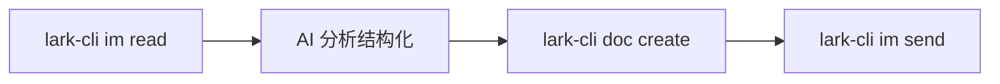
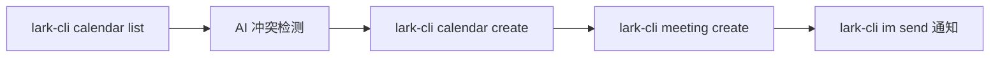
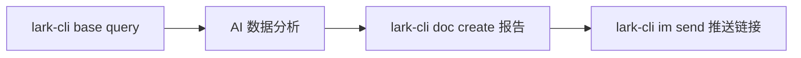

# 公众号文章核心要点提炼：Codex + 飞书 CLI 接入

> **来源**: 微信公众号「如何通过 Codex 对话接入飞书完整版来了！」
> **日期**: 2026-06-02
> **标签**: #Codex #飞书 #CLI #MCP #自动化 #Agent #办公Agent #龙虾全域技能池
> **Obsidian 链接**: [[Codex+飞书CLI自动化技能手册]] [[SKILLS]] [[龙虾全域官方模板-最终版]]

---

## 一、文章摘要

飞书 CLI (lark-cli) 于 2026 年 4 月正式开源，为 AI Agent 提供了一套完整的命令行工具来操作飞书办公套件。覆盖即时通讯、云文档、多维表格、日历、会议、邮箱等 11 大业务域，200+ 命令和 19 个 Agent Skills，GitHub 5.5k+ Star。配合 Codex 等 AI 工具，飞书从"人使用的工具"升级为"AI 直接调用的执行层"，实现群聊→文档→消息的全自动闭环。

---

## 二、核心知识点结构化提炼

### 2.1 技术架构

| 层级 | 组件 | 说明 |
|------|------|------|
| AI 层 | Codex / Claude Code / Cursor | 自然语言交互入口 |
| CLI 层 | lark-cli (npm 全局包) | 200+ 命令，三层调用结构 |
| Skills 层 | 19 个 Agent Skills | 专门为 AI Agent 设计的操作封装 |
| API 层 | 飞书开放平台 (2500+ 接口) | 底层接口支撑 |

### 2.2 三层调用结构

```
Layer 1: 快捷命令 ("+" 前缀) → 最简调用
Layer 2: API 命令 → 对应飞书开放接口
Layer 3: 通用 API 调用 → 2500+ 接口全覆盖
```

### 2.3 CLI vs 传统 API 优势

| 维度 | 传统 API | 飞书 CLI |
|------|---------|---------|
| 调用方式 | 需编写代码 | AI 直接执行命令 |
| 错误处理 | 返回 HTTP 状态码 | 结构化错误，AI 可自动修复 |
| 权限管理 | 手动查文档配置 | 权限不足自动引导补授权 |
| Token 消耗 | 需自行优化 | 内置智能默认值 + 批量优化 |
| Agent 友好度 | 低 | 高（命令结构专为 AI 调用优化） |

### 2.4 五大业务域核心命令

| 业务域 | 核心命令 | 自动化场景 |
|--------|---------|-----------|
| 即时通讯 (IM) | `im send` / `im list` / `im read` | 群聊消息读取→整理→自动回复 |
| 云文档 (Doc) | `doc create` / `doc get` / `doc search` | 自动创建报告→写入内容→分享 |
| 日历 (Calendar) | `calendar list` / `calendar create` | 日程查询→冲突检测→自动创建 |
| 多维表格 (Base) | `base query` / `base create` | 数据查询→分析→生成文档报告 |
| 会议 (Meeting) | `meeting create` / `meeting list` | 会议创建→邀请→日程同步 |

### 2.5 Codex 接入双路径

| 路径 | 复杂度 | 适用场景 |
|------|--------|---------|
| **自动安装**（丢 README 链接） | ⭐ 极简 | 通用飞书操作（消息/文档/日历） |
| **MCP 手动接入**（5 步） | ⭐⭐⭐ | 个人飞书文档读写，需 OAuth |

### 2.6 关键权限矩阵

| 权限标识 | 用途 | 必要性 |
|---------|------|--------|
| `auth:user.id:readoffline_access` | 离线身份读取 | ★★★ |
| `docx:document` | 文档读写 | ★★★ |
| `drive:drive` | 云空间访问 | ★★★ |
| `search:docs:read` | 文档搜索 | ★★☆ |

---

## 三、技能可复用 SOP 模板

### SOP 1：群聊消息→文档整理→发送（全自动闭环）



触发：用户指令 / 定时任务
耗时：< 30 秒
应用：每日群聊摘要、项目讨论归档、客服对话整理

### SOP 2：日历+会议自动化



触发：用户指令"帮我安排下周评审会"
耗时：< 20 秒
应用：周会自动排期、项目评审安排、1v1 面谈预约

### SOP 3：Base 数据查询→报告生成



触发：定时任务 / 手动触发
耗时：< 60 秒
应用：销售数据日报、项目进度周报、库存监控告警

---

## 四、与龙虾全域技能池的关联分析

### 4.1 直接关联协议

| 关联协议 | 关联点 | 融合方向 |
|---------|--------|---------|
| #123 多渠道Gateway桥接协议 | 飞书作为新渠道接入Gateway | 飞书消息路由 → Gateway 统一调度 |
| #96 多形态Agent统一运行时协议 | CLI 形态扩展 Agent 运行时 | 飞书 CLI 作为 CLI 形态子运行时 |
| #17 MCP桥接集成协议 | 飞书 MCP 接入 | MCP Server 注册飞书工具集 |
| #53 Windows桌面视觉操控协议 | 配合飞书桌面端操控 | 视觉操控 + CLI 命令双通道 |

### 4.2 能力矩阵扩展

| 新能力维度 | 来源 | 龙虾融合点 |
|-----------|------|-----------|
| 飞书办公自动化 | 飞书 CLI 11 大业务域 | Agent 直接操作办公套件 |
| 三层 CLI 调用 | lark-cli 架构设计 | 通用 CLI 三层调用模式可复用 |
| 权限自动引导 | CLI 内置机制 | 可下沉为龙虾 SafeGuard 子模块 |
| Token 优化策略 | CLI 智能默认值 | 可纳入上下文工程协议 |

### 4.3 对标矩阵新维度建议

| 新维度 | 豆包 Agent | Codex | 说明 |
|--------|:---------:|:-----:|------|
| 飞书办公自动化 | 98 | 95 | CLI+MCP 双路径 + 3 SOP 模板 |

---

## 五、Obsidian 双向链接

- **上游关联**: [[龙虾全域官方模板-最终版]] — 模板 v3.42，协议 #168
- **技能关联**: [[Codex+飞书CLI自动化技能手册]] — 完整技能手册
- **协议关联**: [[SKILLS]] — 技能编号 #168
- **对标关联**: [[龙虾对标融合矩阵]] — 新增飞书办公自动化维度
- **迭代关联**: [[20260602_R46_全域迭代报告]] — R46 迭代报告

---

> **知识状态**: ✅ 已沉淀
> **下次策展**: 2026-06-09
> **策展优先级**: P1（办公自动化是高频场景）