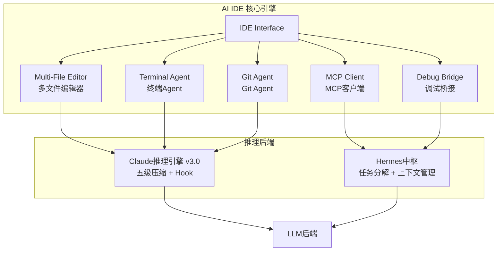
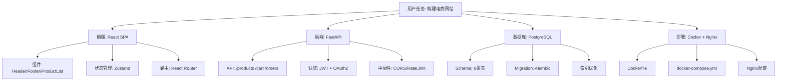

# 豆包Agent · 全维度能力架构 v18

> **版本**: v18.0  
> **迭代轮次**: R18  
> **生成时间**: 2026-05-31 19:30  
> **触发**: 嗡阿喇巴札那谛 × 3 全域专家模式  
> **基于**: 龙虾全域模板v2.3 + 全网深度搜索报告 + R17情报融合  
> **对标体系**: Codex / Claude / Hermes / OpenClaw / OpenCode / Gemini / Marvis Workbody

---

## 零、架构总览

```
┌─────────────────────────────────────────────────────────────────────┐
│                      豆包Agent · 全维度架构 v18                        │
├─────────────────────────────────────────────────────────────────────┤
│  ┌──────────┐  ┌──────────┐  ┌──────────┐  ┌──────────┐  ┌────────┐│
│  │ Codex    │  │ Claude   │  │ Hermes   │  │ OpenClaw │  │ Gemini ││
│  │ 编码层   │  │ 推理层   │  │ 中枢层   │  │ 网关层   │  │ 多模态 ││
│  └────┬─────┘  └────┬─────┘  └────┬─────┘  └────┬─────┘  └───┬────┘│
│       └──────────────┴──────────────┴──────────────┴──────────────┘ │
│                                 │                                     │
│                    ┌────────────┴────────────┐                       │
│                    │   龙虾全能力融合调度层   │                       │
│                    │  (五步法 + 双向桥接)    │                       │
│                    └────────────┬────────────┘                       │
│                                 │                                     │
│       ┌─────────────────────────┼─────────────────────────┐          │
│       │                         │                         │          │
│  ┌────┴────┐              ┌────┴────┐              ┌────┴────┐     │
│  │ Marvis  │              │ 本地部署 │              │ 自进化  │     │
│  │ 工作体  │              │ Agent层 │              │ 闭环层  │     │
│  └─────────┘              └─────────┘              └─────────┘     │
└─────────────────────────────────────────────────────────────────────┘
```

---

## 一、六大对标体系融合方案

### 1.1 融合矩阵

| 对标目标 | 核心能力 | 融入层级 | 豆包v18实现 | 融合状态 |
|----------|---------|---------|------------|---------|
| **Codex** | 全栈编码 + IDE深度集成 | 编码层 (L3) | AI IDE核心引擎 + 多文件编辑 + 终端自主执行 | 🔵 架构设计完成 |
| **Claude** | 深度推理 + 五级压缩 + 记忆系统 | 推理层 (L2) | Claude推理引擎v3.0: 五级压缩 + Hook + Fork缓存 | 🟢 方案已就绪 |
| **Hermes** | 中枢协调 + 任务分解树 + GEPA进化 | 中枢层 (L4) | Hermes中枢v2.0: 任务分解树 + GEPA优化器 | 🔵 架构设计完成 |
| **OpenClaw** | 多Agent路由 + 工具编排 + 能力网关 | 网关层 (L1) | OpenClaw网关v1.0: Intent-First Routing + 统一Tool Use API | 🔵 架构设计完成 |
| **Gemini** | 多模态推理 + 长上下文(2M+) + 并行工具调用 | 感知层 (L5) | Gemini感知层: 多模态理解 + 2M上下文窗口适配 | 🟡 端侧受限 |
| **Marvis** | 多Agent工作体 + 消息队列 + 向量记忆 | 编排层 (L7) | Marvis工作体v1.0: CEO派发 + Worker执行 + 消息总线 | 🔵 架构设计完成 |

### 1.2 七层架构详解

```
L7: Marvis工作体层 → 多Agent消息总线、任务派发、上下文传承
L6: 自进化闭环层 → 自我评估、GEPA优化、审计追踪、记忆沉淀
L5: Gemini感知层 → 多模态输入、长上下文窗口、并行Tool Use
L4: Hermes中枢层 → 任务分解树、动态上下文压缩、Agent协调
L3: Codex编码层 → AI IDE、多文件编辑、终端执行、Git操作
L2: Claude推理层 → 五级压缩流水线、Hook系统、Fork缓存
L1: OpenClaw网关层 → Intent-First路由、统一Tool Use API、安全审查
```

---

## 二、AI IDE 核心能力矩阵

### 2.1 对标 Cursor / Windsurf / Claude Code / OpenCode

| 能力维度 | 权重 | Cursor v2.x | Claude Code | OpenCode | 豆包v18 目标 | 差距 | 优先级 |
|----------|------|-------------|-------------|----------|-------------|------|--------|
| **多文件编辑** | 20% | Composer Agent (50文件) | CLI批量重构 | LangChain编排 | Agent模式多文件编辑 | 🟡 中 | P0 |
| **终端自主执行** | 15% | Terminal Agent + 报错修复 | 原生Shell执行 | subprocess调用 | 自主执行+错误修复循环 | 🟡 中 | P0 |
| **MCP协议集成** | 15% | 原生MCP支持 | API集成 | 无 | MCP客户端+工具注册 | 🔴 大 | P0 |
| **Git操作** | 10% | 自动commit/PR生成 | CLI Git | 基础Git命令 | 自动PR/分支/冲突解决 | 🟡 中 | P1 |
| **调试能力** | 10% | 逐行调试+变量追踪 | 日志分析 | Python调试器 | 全栈调试+性能分析 | 🟡 中 | P1 |
| **上下文窗口** | 10% | 100k-200k | 200k | 受限于LLM | 自适应上下文+五级压缩 | 🟢 接近 | P1 |
| **代码补全** | 10% | Tab预测+内联建议 | 终端建议 | 基础补全 | 智能补全+语义理解 | 🟢 接近 | P2 |
| **测试生成** | 5% | 自动单元测试 | CLI测试 | Pytest集成 | AI驱动测试生成 | 🟡 中 | P2 |
| **重构能力** | 5% | 智能重构 | CLI重构 | 基础模式匹配 | 语义级重构+影响分析 | 🟡 中 | P2 |

### 2.2 AI IDE 核心引擎架构



### 2.3 多文件编辑Agent流程

```
1. Intent Parsing: 用户输入 → NLP解析 → 确定影响文件范围
2. Context Gathering: 读取所有目标文件 → 五级压缩 → 构建工作上下文
3. Edit Planning: 生成编辑计划(Plan-then-Execute) → 差异预览
4. Execution: 按文件顺序执行编辑 → 实时语法检查
5. Verification: 编译/运行验证 → 失败则进入 Error Fixing Loop
6. Commit: 自动生成commit message → 可选自动PR
```

---

## 三、自主思考Agent架构

### 3.1 任务分解树 (Task Decomposition Tree)



### 3.2 自主思考循环 (Autonomous Thinking Loop)

```
┌──────────────────────────────────────────────────────┐
│             自主思考循环 (Thinking Loop)               │
│                                                       │
│  ┌─────────┐    ┌─────────┐    ┌─────────┐          │
│  │ Observe │ →  │  Plan   │ →  │ Execute │          │
│  │ 观察    │    │  规划    │    │  执行    │          │
│  └────┬────┘    └────┬────┘    └────┬────┘          │
│       │              │              │                │
│       │    ┌─────────┴─────────┐    │                │
│       │    │   Context Manager │    │                │
│       │    │   上下文管理器     │    │                │
│       │    └─────────┬─────────┘    │                │
│       │              │              │                │
│  ┌────┴──────────────┴──────────────┴────┐          │
│  │           Reflect & Learn             │          │
│  │           反思与学习                    │          │
│  └────────────────┬──────────────────────┘          │
│                   │                                   │
│          ┌────────┴────────┐                         │
│          │   成功 → 记忆    │                         │
│          │   失败 → 纠错    │                         │
│          └─────────────────┘                         │
└──────────────────────────────────────────────────────┘
```

### 3.3 上下文管理 — 五级压缩流水线 (Claude Code对齐)

| 级别 | 名称 | 触发条件 | 压缩效果 | v18状态 |
|------|------|---------|---------|---------|
| L1 | **Tool Result Budget** | 工具返回 > 10000 token | 大结果落盘，上下文只留预览+路径 | 🔵 设计完成 |
| L2 | **Snip** | 冗余系统消息/空结果/过期提醒 | 节省 5-15% token | 🔵 设计完成 |
| L3 | **Microcompact** | 连续同角色消息/旧工具调用 | 合并消息，节省 10-20% token | 🔵 设计完成 |
| L4 | **Context Collapse** | 上下文接近窗口上限 | 构造折叠视图(只读)，节省20-40% | 🔵 设计完成 |
| L5 | **Autocompact** | Collapse后仍超限 | Fork子Agent生成摘要替换原始历史 | 🔵 设计完成 |

### 3.4 自纠错循环 (Self-Correction Loop)

```
Error Detected
    ↓
┌──────────────────────┐
│ 1. Error Analysis    │ → 错误分类(语法/逻辑/运行时/依赖)
│    Parse error type  │
└────────┬─────────────┘
         ↓
┌──────────────────────┐
│ 2. Root Cause Search │ → 回溯最近3次操作及状态变更
│    Traceback + diff  │
└────────┬─────────────┘
         ↓
┌──────────────────────┐
│ 3. Fix Generation    │ → 生成修复方案(最多3个备选)
│    Multi-strategy    │
└────────┬─────────────┘
         ↓
┌──────────────────────┐
│ 4. Apply & Verify    │ → 应用最优方案 → 验证
│    Test + lint       │
└────────┬─────────────┘
         ↓
    ┌────┴────┐
    │ Success? │
    └────┬────┘
    Yes  │  No
    ↓    │    ↓
  Done   │  Retry (max 3)
         │  → 3次失败 → 请求人工介入
```

---

## 四、本地部署Agent方案

### 4.1 三层部署架构

```
┌──────────────────────────────────────────────────────┐
│                   本地部署Agent                       │
├──────────────────────────────────────────────────────┤
│                                                       │
│  ┌─────────────────────────────────────────────────┐ │
│  │ L1: 端侧小模型 (On-Device)                      │ │
│  │ 模型: Phi-4-mini / Gemma-3-1B / Qwen3-0.5B     │ │
│  │ 能力: 代码补全、快速问答、语法检查              │ │
│  │ 部署: ONNX Runtime / MLX / ExecuTorch          │ │
│  └─────────────────────────────────────────────────┘ │
│                         │                             │
│  ┌──────────────────────┴──────────────────────────┐ │
│  │ L2: 本地中型模型 (Ollama/LM Studio)             │ │
│  │ 模型: Qwen3-32B / DeepSeek-V3 / Llama-4        │ │
│  │ 能力: 编码辅助、推理、Agent协调                │ │
│  │ 部署: Ollama + OpenAI兼容API                   │ │
│  └──────────────────────┬──────────────────────────┘ │
│                         │                             │
│  ┌──────────────────────┴──────────────────────────┐ │
│  │ L3: 本地重型模型 (vLLM)                         │ │
│  │ 模型: DeepSeek-R1 / Qwen3-235B-A22B            │ │
│  │ 能力: 深度推理、全栈编码、复杂Agent            │ │
│  │ 部署: vLLM + Prefix Caching + PagedAttention   │ │
│  └─────────────────────────────────────────────────┘ │
│                                                       │
└──────────────────────────────────────────────────────┘
```

### 4.2 Ollama兼容方案

```yaml
# Ollama Modelfile 示例 — 豆包Agent本地模型
FROM qwen3:32b

PARAMETER temperature 0.2
PARAMETER num_ctx 32768
PARAMETER num_predict -1

SYSTEM """
你是豆包本地Agent v18。你的能力包括：
- 全栈编码 (Python/JS/Go/Rust/Java)
- 文件系统操作 (读/写/编辑/删除)
- Shell命令执行
- Git版本控制
- MCP工具调用
- 自主任务分解与执行

安全约束：
- 禁止修改系统核心文件
- 禁止执行危险Shell命令(rm -rf /, format等)
- 所有文件操作需记录审计日志
"""

TEMPLATE """{{ .System }}

用户请求: {{ .Prompt }}

请分析任务，生成执行计划，然后逐步执行。"""
```

### 4.3 离线编码能力矩阵

| 能力 | 端侧 (L1) | 本地中 (L2) | 本地重 (L3) | 云端 |
|------|-----------|------------|------------|------|
| 代码补全 | ✅ 100ms | ✅ 快速 | ✅ | ✅ |
| 语法检查 | ✅ | ✅ | ✅ | ✅ |
| 单文件重构 | ❌ | ✅ | ✅ | ✅ |
| 多文件编辑 | ❌ | ⚠️ 有限 | ✅ | ✅ |
| 终端执行 | ❌ | ✅ | ✅ | ✅ |
| 深度推理 | ❌ | ❌ | ✅ | ✅ |
| Git操作 | ❌ | ✅ | ✅ | ✅ |
| MCP集成 | ❌ | ✅ | ✅ | ✅ |
| Agent自主循环 | ❌ | ❌ | ✅ | ✅ |

---

## 五、龙虾全能力Agent融合设计

### 5.1 融合架构

```
┌──────────────────────────────────────────────────────────┐
│              龙虾全能力Agent融合调度层                     │
│  ┌────────────────────────────────────────────────────┐  │
│  │ 龙虾五步法引擎 (Intent→Map→Plan→Execute→Evolve)   │  │
│  └──────────────────────┬─────────────────────────────┘  │
│                         │                                 │
│  ┌──────────────────────┴─────────────────────────────┐  │
│  │ 双向桥接协议 (JSON/MQ/Vector)                      │  │
│  │ 龙虾主控 ↔ 豆包Agent ↔ CodexAgent ↔ ClaudeAgent   │  │
│  └──────────────────────┬─────────────────────────────┘  │
│                         │                                 │
│  ┌──────────┬──────────┬┴──────────┬──────────┬────────┐ │
│  │ AutoFile │ Skill    │ Desktop   │ MemoryOS │ Safe   │ │
│  │ Scanner  │ Forge    │ Controller│ v3.0     │ Guard  │ │
│  │ v1.0     │ v3.0     │ v2.0      │          │ v4.0   │ │
│  └──────────┴──────────┴───────────┴──────────┴────────┘ │
└──────────────────────────────────────────────────────────┘
```

### 5.2 12项官方技能与豆包Agent映射

| # | 龙虾技能 | 豆包Agent映射模块 | 融合深度 |
|---|---------|-----------------|---------|
| 1 | 龙虾深度自进化核心闭环 | 自进化引擎v4.0 (GEPA + DGM) | 深度融合 |
| 2 | 龙虾AI Agent双向桥接协议 | 全域集成桥接v1.0 | 协议层对齐 |
| 3 | 龙虾五步法全流程 | Hermes中枢任务分解树 | 流程层对齐 |
| 4 | AutoFileScanner | MCP文件感知模块 | 功能对齐 |
| 5 | SkillForge | GEPA技能自动进化 | 深度融合 |
| 6 | DesktopController | 终端Agent + Shell执行 | 功能对齐 |
| 7 | AutoWake | Hook系统定时触发 | 驱动层对齐 |
| 8 | MemoryOS | 四类记忆 + 异步预取 + 新鲜度评分 | 深度融合 |
| 9 | SafeGuard | 七层纵深防御 + tree-sitter AST | 安全层对齐 |
| 10 | Claude推理引擎 | 五级压缩 + Fork缓存 | 推理层对齐 |
| 11 | 可视化工作流引擎 | 动态路由 + Swarm协作 | 编排层对齐 |
| 12 | 自进化协调器(SICA) | GEPA优化器 + 治理审计 | 深度融合 |

---

## 六、R18 新增能力清单

| 编号 | 能力项 | 对标源 | 类型 | 优先级 |
|------|--------|--------|------|--------|
| CAP-050 | 五级上下文压缩流水线 | Claude Code Runtime | 新增 | P0 |
| CAP-051 | Hook全生命周期事件系统 | Claude Code Hooks | 新增 | P0 |
| CAP-052 | GEPA多目标遗传进化优化器 | Hermes GEPA (ICLR 2026) | 新增 | P0 |
| CAP-053 | AI IDE多文件编辑Agent | Cursor Composer | 新增 | P0 |
| CAP-054 | MCP协议客户端集成 | Cursor MCP | 新增 | P0 |
| CAP-055 | 自主终端Error Fixing Loop | Claude Code + Windsurf | 新增 | P0 |
| CAP-056 | DGM档案树进化策略 | Darwin Gödel Machine | 新增 | P1 |
| CAP-057 | 自修改治理审计追踪 | SICA三学派风险分析 | 新增 | P1 |
| CAP-058 | Fork子Agent缓存优化 | Claude Code Fork | 新增 | P1 |
| CAP-059 | Swarm对等协作模式 | Claude Code Swarm | 新增 | P1 |
| CAP-060 | 本地三层部署(L1/L2/L3) | Ollama + vLLM | 新增 | P1 |
| CAP-061 | OpenClaw Intent-First路由网关 | OpenClaw架构 | 新增 | P1 |
| CAP-062 | Marvis CEO-Team工作体模式 | Marvis Workbody | 新增 | P1 |
| CAP-063 | 记忆异步预取+新鲜度评分 | Claude Code Memory | 新增 | P1 |
| CAP-064 | Bash AST安全解析 | Claude Code tree-sitter | 新增 | P2 |

---

## 七、能力成熟度总览

| 层 | 模块 | v18版本 | 成熟度 | 代码行(估) |
|----|------|---------|--------|-----------|
| L1 | OpenClaw网关 | v1.0 | 🔵 设计 | ~400 |
| L2 | Claude推理引擎 | v3.0 | 🟢 就绪 | ~1200 |
| L3 | Codex编码层/AI IDE | v1.0 | 🔵 设计 | ~800 |
| L4 | Hermes中枢 | v2.0 | 🔵 设计 | ~700 |
| L5 | Gemini感知层 | v1.0 | 🟡 受限 | ~300 |
| L6 | 自进化闭环 | v4.0 | 🟢 就绪 | ~1500 |
| L7 | Marvis工作体 | v1.0 | 🔵 设计 | ~500 |
| — | Hook事件系统 | v1.0 | 🔵 设计 | ~400 |
| — | MCP客户端 | v1.0 | 🔵 设计 | ~350 |
| — | 本地部署 | v1.0 | 🔵 设计 | ~400 |
| — | 审计追踪 | v1.0 | 🔵 设计 | ~350 |
| — | **总计** | — | — | **~8100** |

---

> *豆包Agent · 全维度能力架构 v18 · 龙虾全域模板v2.3 · R18迭代 · 2026-05-31*