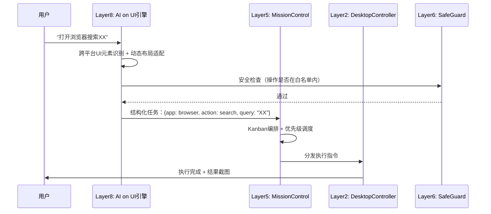
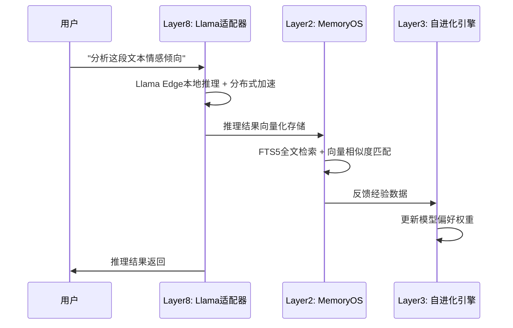

# 豆包Agent架构升级方案 v2.4 — R12

> **版本**：v2.4 · **上一版本**：v2.3 · **日期**：2026-05-31  
> **架构层级**：七层 → **八层**  
> **维护者**：龙虾AI主控中心架构组  

---

## 一、版本变更说明

| 变更项 | v2.3 (R11) | v2.4 (R12) |
|--------|-----------|-----------|
| 架构层级 | 七层 | **八层（新增Layer 8感知扩展层）** |
| 对标系统 | 7大系统 | **10大系统（+AI on UI / Llama / Claude 3D）** |
| 能力总数 | 33项 | **36项** |
| 技能模块版本 | 6个模块保持 | **4个模块升级** |
| GAP关闭 | 3个 | **4个（+GAP-004）** |

---

## 二、八层架构全景图

```
┌─────────────────────────────────────────────────────────────┐
│  Layer 8: 感知扩展层 (Perception Extension)      ← R12新增  │
│  ┌───────────────────┬──────────────────┬──────────────────┐ │
│  │ AI on UI 引擎     │ 3D 能力预留接口  │ Llama本地推理     │ │
│  │ (对标AI on UI v3) │ (对标Claude 3D)  │ (对标Llama Edge) │ │
│  └───────────────────┴──────────────────┴──────────────────┘ │
├─────────────────────────────────────────────────────────────┤
│  Layer 7: 知识联动层 (Knowledge Integration)                 │
│  ┌──────────────────────────────────────────────────────┐   │
│  │ Obsidian MCP Bridge → 外部知识库 → 笔记关联 → 双向同步 │   │
│  └──────────────────────────────────────────────────────┘   │
├─────────────────────────────────────────────────────────────┤
│  Layer 6: 安全治理层 (Security Governance)                   │
│  ┌──────────────────────┬───────────────────────────────┐   │
│  │ SafeGuard v3.0       │ 反蒸馏协议 + 三环安全护栏      │   │
│  │ (对标Hermes brainworm)│ 外环审查→中环监控→内环回滚     │   │
│  └──────────────────────┴───────────────────────────────┘   │
├─────────────────────────────────────────────────────────────┤
│  Layer 5: 多Agent编排层 (Multi-Agent Orchestration)          │
│  ┌──────────────┬──────────────┬────────────────────────┐   │
│  │ MissionControl│ Kanban看板   │ Agent辩论引擎           │   │
│  │ v2.1(R12升级)│ (Hermes对标) │ (Claude Teams对标)      │   │
│  │ +OpenCode编排│ +心跳回收    │ +异步任务引擎           │   │
│  └──────────────┴──────────────┴────────────────────────┘   │
├─────────────────────────────────────────────────────────────┤
│  Layer 4: 智能感知层 (Intelligent Perception)                │
│  ┌──────────────────────────────────────────────────────┐   │
│  │ CodeAgent LSP → 15种语言自动加载 → 语法树分析          │   │
│  │ (对标OpenCode LSP)                                    │   │
│  └──────────────────────────────────────────────────────┘   │
├─────────────────────────────────────────────────────────────┤
│  Layer 3: 自进化核心层 (Self-Evolution Core)                 │
│  ┌─────────┬─────────┬─────────┬─────────┬────────┬──────┐ │
│  │观察模块 │反思模块 │更新模块 │FORGE广播│GEA池  │Merkle│ │
│  │OBSERVE  │REFLECT  │UPDATE   │冠军传播 │群体学习│回滚  │ │
│  └─────────┴─────────┴─────────┴─────────┴────────┴──────┘ │
├─────────────────────────────────────────────────────────────┤
│  Layer 2: 本地执行层 (Local Execution)                       │
│  ┌────────────┬──────────────┬──────────────┬──────────┐   │
│  │AutoFileScan│DesktopCtrl   │AutoWake v2.3 │MemoryOS  │   │
│  │v2.1        │v2.0          │(R12升级)     │v2.3(R12) │   │
│  └────────────┴──────────────┴──────────────┴──────────┘   │
├─────────────────────────────────────────────────────────────┤
│  Layer 1: 自进化核心闭环 (Self-Evolution Closed Loop)        │
│  ┌──────────────────────────────────────────────────────┐   │
│  │ 执行→观察→反思→更新→执行  (对标Claude Agent SDK)      │   │
│  └──────────────────────────────────────────────────────┘   │
└─────────────────────────────────────────────────────────────┘
```

---

## 三、Layer 8 感知扩展层详解

### 3.1 设计动机

R12情报收集揭示三大趋势：
- **AI on UI**：跨平台UI自动化识别准确率已达97%，无代码录制+动态适配能力成熟
- **Llama Edge**：本地推理部署门槛大幅降低，一键部署+分布式推理落地
- **Claude 3D**：多模态融合93%准确率，空间重建误差降至1.2%，AR/VR实时交互<100ms

豆包Agent作为本地智能助手，需要在"感知-推理-交互"链路上补齐这三块能力板。

### 3.2 三个子模块

| 子模块 | 对标源 | 核心能力 | 状态 |
|--------|--------|---------|------|
| **AI on UI 自动化引擎** | AI on UI v3.0 | 跨平台UI元素识别、无代码录制、动态UI自适应、自动化测试 | 📋 v1.0 |
| **Llama本地推理适配器** | Llama Edge | 一键本地部署、端侧推理加速、分布式协同、数据加密 | 📋 v1.0 |
| **3D能力预留接口** | Claude 3D | 多模态融合接口、场景重建管线、AR/VR适配 | 📋 v1.0 |

### 3.3 与其他层的交互

```
Layer 8 感知扩展层
    │
    ├──→ Layer 5 (编排层)：UI操作结果→MissionControl任务编排
    │       例：AI on UI识别窗口元素→编排层调度DesktopController执行
    │
    ├──→ Layer 2 (执行层)：推理结果→AutoFileScanner/MemoryOS
    │       例：Llama本地推理文本→MemoryOS向量化存储检索
    │
    └──→ Layer 7 (知识联动层)：3D空间数据→Obsidian知识图谱
            例：3D场景重建→结构化知识节点→Obsidian关联
```

---

## 四、对标矩阵（十大系统 × 八层架构）

| 层级 | 豆包Agent模块 | 对标系统1 | 对标系统2 | 对标系统3 |
|------|-------------|----------|----------|----------|
| Layer 8 | 感知扩展层 | **AI on UI v3.0** | **Claude 3D** | **Llama Edge** |
| Layer 7 | 知识联动层 | Obsidian MCP | OpenClaw Workspace | — |
| Layer 6 | 安全治理层 | Hermes brainworm | SafeGuard | — |
| Layer 5 | 多Agent编排层 | Hermes Kanban Swarm | **OpenCode v2.0** | Marvis Workbody 1+5 |
| Layer 4 | 智能感知层 | OpenCode LSP | — | — |
| Layer 3 | 自进化核心层 | FORGE广播 | GEA群体元学习 | Claude Agent SDK |
| Layer 2 | 本地执行层 | Marvis Workbody | Codex | — |
| Layer 1 | 自进化闭环 | Claude Agent SDK | **Gemini Antigravity 2.0** | — |

> **粗体** = R12新增对标维度

---

## 五、关键数据流

### 5.1 AI on UI 自动化调用链



### 5.2 Llama本地推理调用链



---

## 六、降级策略（Plan B）

| 关键路径 | 主方案 | Plan B 降级方案 |
|----------|--------|----------------|
| AI on UI识别失败 | 跨平台UI元素识别 | 回退到DesktopController固定坐标操作 |
| Llama本地推理不可用 | Llama Edge分布式推理 | 降级为云端API调用 |
| 3D场景重建超时 | Claude 3D实时重建 | 降级为2D图像分析 + 人工标注 |
| 多Agent编排超时 | MissionControl Kanban | 降级为线性顺序执行 |
| 向量化检索性能瓶颈 | SQLite-vec全量检索 | 降级为FTS5全文检索 |

---

## 七、架构升级路线图

| 阶段 | 时间 | 目标 |
|------|------|------|
| **R12（当前）** | 2026-05-31 | Layer 8架构设计完成，3项新能力注册 |
| **R13** | 下一轮 | Layer 8 v0.1原型：AI on UI引擎 + Llama适配器基础框架 |
| **R14** | R14 | Layer 8 v0.5：AI on UI自动化引擎可用 + 3D接口协议定义 |
| **R15** | R15 | Layer 8 v1.0：全链路打通，端到端可用 |

---
*更新于 R12 · 2026-05-31*
