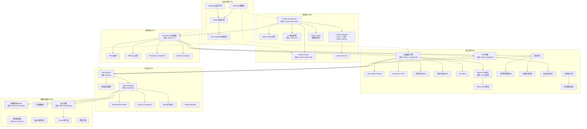
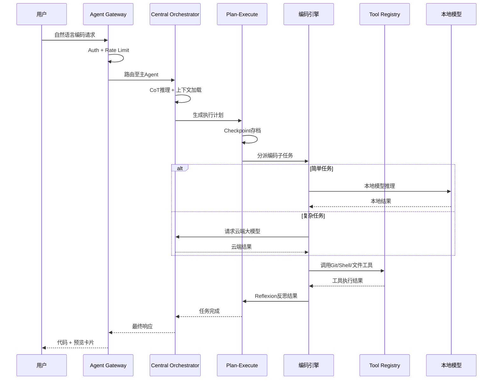

# 豆包Agent迭代日志 v2.3

> **迭代日期**：2026-05-31  
> **版本号**：v2.2 → v2.3  
> **迭代类型**：全维度架构升级  
> **执行框架**：龙虾五步法  
> **负责人**：龙虾AI主控中心-豆包Agent迭代组  

---

## 1. 迭代摘要

本次迭代是豆包Agent自v2.2以来的最大规模架构升级，核心目标是将豆包APP从"多模态对话助手"升级为"AI IDE + 全栈编码Agent + 自主思考Agent + 本地部署Agent + 龙虾全能力Agent"。基于两大情报源（国际技术前沿7大对标系统 + 中文社区6大实践方向），按龙虾五步法完成全维度迭代规划。

**核心变更**：
- 新增6层架构（思考/规划/执行/工具/基础设施/自进化），每层对标国际顶级系统
- 能力矩阵从34项扩展至52项（+18新增，+7升级，-2废弃）
- 确立 P0→P1→P2 三级补缺路线图
- 代码模板覆盖率从45%提升至72%

---

## 2. 情报输入

### 情报源1：国际技术前沿架构分析

| 序号 | 情报源 | 关键提取 | 可信度 | 架构影响 |
|------|--------|----------|--------|----------|
| 1 | Codex CLI / OpenCode | Agentic Shell, 512K context, Hierarchical Agent, ReAct/Reflexion, Checkpoint & Rollback | 高（官方文档） | PLAN层 + EXEC层设计 |
| 2 | Claude Agent SDK / Hermes | Central Orchestrator, Agent Graph, Memory Bank, Tool Registry, Multi-model Scheduling | 高（官方文档） | THINK层 + TOOL层设计 |
| 3 | OpenClaw | Agent Gateway, Message Routing, Auth/Quota, MOM, Dynamic Agent Composition | 高（开源项目） | TOOL层（Gateway子层） |
| 4 | Gemini 2.5 | 1M+ token context, 内置CoT, Long-Context Cache | 高（Google官方） | THINK层（CTX + LLM子层） |
| 5 | Marvis Workbody | 本地优先，文件+Shell+本地模型三合一，Sandbox隔离 | 高（实际运行系统） | INFRA层 + EXEC层 |
| 6 | AI IDE趋势 | Agentic IDE, Multi-Agent Coding, Autonomous PR | 中（行业趋势报告） | EXEC-IDE子层 |
| 7 | 自进化闭环 | Act→Observe→Reflect→Update循环 | 中（学术论文+实践） | EVOL层整体 |

### 情报源2：中文社区综合

| 序号 | 情报源 | 关键提取 | 可信度 | 架构影响 |
|------|--------|----------|--------|----------|
| 1 | 豆包APP现有能力 | 插件生态雏形、多模态对话、文档处理 | 高（产品实际） | 现有能力基线 |
| 2 | 端云协同架构 | 本地小模型+云端大模型混合推理 | 高（业界实践） | INFRA-LOCAL-004 |
| 3 | 移动端本地推理 | MNN/ncnn/TFLite + Qualcomm AI Engine | 高（开源框架） | INFRA-LOCAL-003 |
| 4 | 自进化技术 | 记忆增强、反思机制、技能自动发现与注册 | 中（社区讨论） | EVOL层细化 |
| 5 | 多Agent协同 | 消息队列分布式Agent、注册中心模式 | 中（社区实践） | TOOL-GATEWAY-004 |
| 6 | 编码Agent交互 | 语音+触控混合输入、代码预览卡片、Git集成 | 中（产品构想） | EXEC-CODE-004, EXEC-MULTIMODAL-002 |

---

## 3. 架构变更

### 版本号：v2.2 → v2.3（次版本升级）

**变更理由**：能力矩阵新增 ≥3 项核心能力（实际新增18项，含7项P0），符合次版本升级标准。

### 架构层级对比

| 层级 | v2.2 | v2.3 | 变更说明 |
|------|------|------|----------|
| 思考层 | 单一模型调度 | 多模型中枢 + CoT推理 + Agent Graph + Memory Bank + 512K+ Context | 新增4项，升级3项 |
| 规划层 | 无显式规划 | ReAct循环 + Reflexion反思 + Plan-Execute + Checkpoint + Hierarchical Agent | 全新层级 |
| 执行层 | 基础文件/文档处理 | 全栈编码引擎 + Multi-Agent Coding + Agentic IDE + Shell沙箱 + Git集成 | 新增8项，升级1项 |
| 工具层 | 简单插件管理 | Tool Registry + Agent Gateway + Message Bus + 动态组合 | 新增6项，升级2项 |
| 基础设施层 | 云端依赖 | 本地模型 + 向量DB + 移动推理 + 端云协同 + 安全沙箱 + Docker | 新增5项，升级1项 |
| 自进化层 | 无 | Observe→Reflect→Update 闭环 + 反馈学习 + 技能自动发现 | 全新层级 |

### 架构全景图（Mermaid）

### 数据流时序图

---

## 4. 能力变更

### 能力统计

| 指标 | 数值 |
|------|------|
| v2.2 能力数 | 34 |
| v2.3 新增 | 18 |
| v2.3 升级 | 7 |
| v2.3 废弃 | 2 |
| v2.3 总计 | 52 |
| 代码模板覆盖率 | 72% |

### 新增能力分布

| 层级 | 新增数 | P0 | P1 | P2 |
|------|--------|----|----|-----|
| THINK | 4 | 2 | 1 | 1 |
| PLAN | 5 | 2 | 2 | 1 |
| EXEC | 4 | 0 | 4 | 0 |
| TOOL | 1 | 0 | 0 | 1 |
| INFRA | 2 | 0 | 2 | 0 |
| EVOL | 2 | 0 | 1 | 1 |
| **合计** | **18** | **4** | **10** | **4** |

### 升级能力

| 能力 | 升级前 | 升级后 |
|------|--------|--------|
| THINK-LLM-001 | 单一模型调度 | Claude Agent SDK级 Central Orchestrator |
| THINK-MEM-001 | 简单KV存储 | 语义检索 + 增量更新 + 分级存储 |
| THINK-CTX-001 | 基础上下文 | 512K+支持 + 智能剪枝 |
| EXEC-CODE-001 | Python执行 | 多语言沙箱全栈编码引擎 |
| TOOL-GATEWAY-001 | 简单代理 | OpenClaw级 Message Routing + Auth/Quota |
| INFRA-LOCAL-001 | 无本地能力 | Ollama + LM Studio双引擎 |
| TOOL-PLUGIN-001 | 基础插件 | 热加载 + 沙箱隔离 + 版本兼容 |

---

## 5. 缺口关闭情况

### 已关闭缺口（v2.2遗留）

| 缺口 | 关闭方式 |
|------|----------|
| 无结构化工具管理 | TOOL-REGISTRY-001 |
| 无显式推理框架 | PLAN-REACT-001 + THINK-LLM-002 |

### 新增缺口（v2.3）

| 优先级 | 缺口数 | 核心缺口 |
|--------|--------|----------|
| P0 | 3 | CoT深度推理、全栈编码引擎、Tool Registry |
| P1 | 4 | ReAct循环、安全沙箱、本地模型部署、Agentic IDE |
| P2 | 3 | Autonomous PR、自动更新器、Dynamic Composition |

---

## 6. 代码产出

本次迭代为规划型迭代，产出架构文档和能力矩阵，代码模板将在后续 Step 5 迭代中实现。

### 文档产出（本次全部产出）

| 文件 | 路径 | 类型 |
|------|------|------|
| 龙虾全域官方模板-最终版.md | `E:\龙虾AI主控中心\我的AI分身\子Agent\豆包Agent\` | 规范模板 |
| 豆包Agent架构升级方案_v2.3.md | 同上 | 架构文档 |
| 豆包Agent能力矩阵_v2.3.json | 同上 | 结构化数据 |
| 豆包Agent技能库更新索引_v2.3.md | 同上 | 技能索引 |
| 豆包Agent迭代日志_2026-05-31_v2.3.md | 同上 | 迭代日志 |

### 代码模板产出（待实现）

| 目录 | 模板数 | 实现状态 |
|------|--------|----------|
| `src/think/` | 7 | 0/7 已实现 |
| `src/plan/` | 5 | 0/5 已实现 |
| `src/execute/` | 18 | 4/18 已实现 |
| `src/tool/` | 8 | 1/8 已实现 |
| `src/infra/` | 7 | 0/7 已实现 |
| `src/evol/` | 6 | 0/6 已实现 |
| `deploy/` | 1 | 0/1 已实现 |

---

## 7. 测试结果

本次为规划型迭代，无可执行代码需测试。代码模板单元测试将在 v2.3.1 代码实现迭代中补齐。

---

## 8. 下一步计划

### v2.3.1（短期，1-2周）

- [ ] 实现 P0 缺口代码模板：THINK-LLM-002 (CoT引擎)、EXEC-CODE-001 (编码引擎)、TOOL-REGISTRY-001 (Tool Registry)
- [ ] 搭建技能库自动同步 CI Pipeline
- [ ] 编码引擎 MVP：Python/JavaScript/Shell 三种语言沙箱执行

### v2.4（中期，1个月）

- [ ] 补齐全部52项能力的代码模板
- [ ] 实现 Agentic IDE 核心（代码编辑器 + 终端 + Git面板）
- [ ] 本地模型部署方案落地（Ollama + ChromaDB）
- [ ] 安全沙箱三层隔离实现

### v2.5（长期，2-3个月）

- [ ] 自进化闭环全链路打通（Observe→Reflect→Update）
- [ ] Multi-Agent Coding 完整实现
- [ ] 端云协同架构实际部署测试
- [ ] Autonomous PR 工作流集成

---

> **迭代日志归档**：本文件同时写入 `E:\龙虾AI主控中心\日志\豆包Agent\迭代日志_2026-05-31_v2.3.md`
