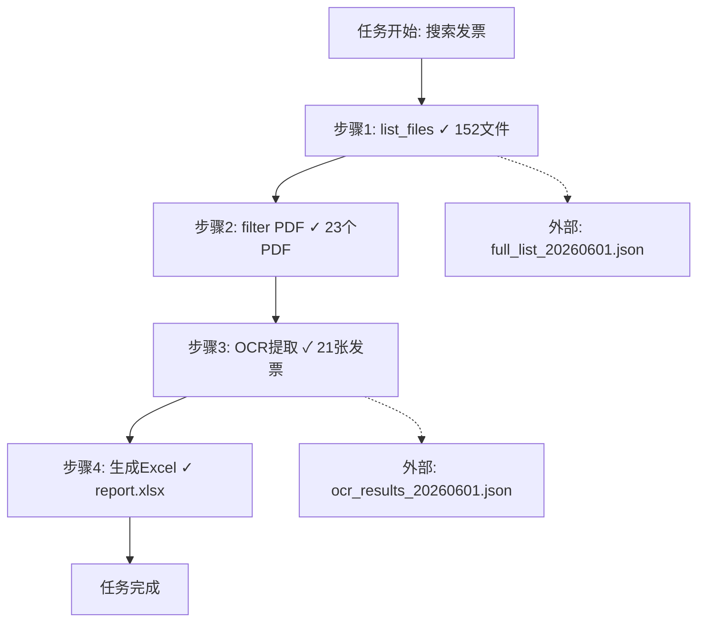

# 龙虾-Mermaid无限画布记忆压缩协议 v1.0

> **协议编号**：55
> **对标来源**：TencentDB Agent Memory 上下文卸载 + Mermaid 结构化图表示
> **生成轮次**：R15
> **生效日期**：2026-06-01

---

## 一、协议概述

通过外部文件系统卸载完整信息 + Mermaid 结构化流程图，将长任务执行过程压缩为可导航的结构化记忆。关键状态以高密度形式留存于上下文，完整信息保留于外部。节省 61% Token，超长 Session 通过率从 33% 提升至 50%（+52%）。

## 二、核心机制

```
┌──────────────────────────────────────────┐
│            上下文窗口（有限 Token）         │
│  ┌────────────────────────────────────┐  │
│  │  Mermaid 流程图（关键状态高密度）      │  │
│  │  - 任务节点 + 状态摘要               │  │
│  │  - 关键决策点                       │  │
│  │  - 下一步指向                       │  │
│  └────────────────────────────────────┘  │
└──────────────────────────────────────────┘
                    ↕ 按需加载
┌──────────────────────────────────────────┐
│        外部文件系统（无限容量）            │
│  ┌────────────────────────────────────┐  │
│  │  完整信息存档                       │  │
│  │  - 工具调用完整结果                  │  │
│  │  - 文件内容全文                     │  │
│  │  - 执行日志                        │  │
│  └────────────────────────────────────┘  │
└──────────────────────────────────────────┘
```

## 三、四层记忆架构

| 层级 | 名称 | 容量 | 内容 |
|------|------|------|------|
| L1 | Palace（宫殿） | 项目级 | 项目全局记忆、原则、规则 |
| L2 | Wing（侧翼） | 会话级 | 当前会话全部完整信息 |
| L3 | Room（房间） | 任务级 | 单个任务的 Mermaid 流程 + 摘要 |
| L4 | Drawer（抽屉） | 步骤级 | 单步骤详细结果，按需加载 |

## 四、触发策略

| 触发条件 | 动作 |
|---------|------|
| Token 使用达窗口 70% | 自动触发上下文卸载 → Mermaid 压缩 |
| 单任务超过 10 步 | 生成 Mermaid 任务流程图 |
| 会话空闲 > 5 分钟 | 触发记忆策展：模式提取 + 噪声过滤 |
| 跨会话恢复 | 加载 L2 Wing 完整信息 + L3 Room 摘要 |

## 五、Mermaid 图格式



## 六、适用场景

- 办公提效长任务（多步骤文件处理）
- 研究型任务（多轮检索+分析）
- 编程任务（多文件修改+测试迭代）
- 创作任务（长文档生成+修改）

---

> **协议状态**：ACTIVE
> **依赖**：协议44 无损层次记忆架构协议 / 协议37 Dreaming跨会话元学习协议
