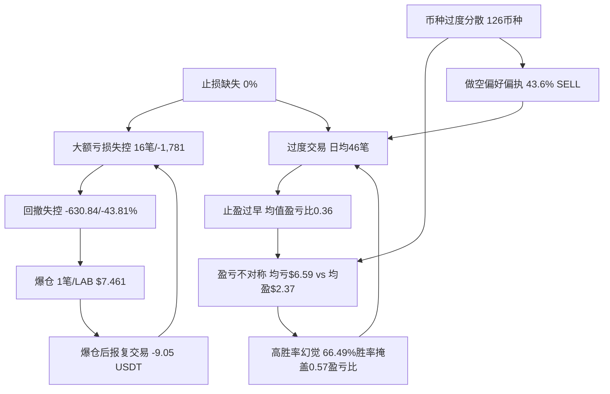

# 交易心理画像

版本号：v2.7
生效日期：2026-06-02 05:15 UTC+8
关联文件：角色总说明书.md (v1.0)、币安订单历史交易行为分析报告_20260602_0515.md (v7.3)、LOBSTER-BLACK-HORSE-v4.json (v4.10.1)
归档目录：E:\龙虾AI主控中心\我的AI分身\角色总说明书\
更新说明：v2.7 定时任务迭代 — 数据源与v2.6完全一致（38单+12,885笔），无新增订单。(1)数据校验通过：CSV文件字段零缺失（BOM字符不影响），时间覆盖05-30 04:39~05-31 03:26；(2)38单净盈亏+24.79 USDT（与v2.6一致），16盈2亏20零盈亏；(3)全量核心指标无任何变化：止损0%、回撤-13.18（本批）/-43.81%（历史）、手续费/净利润4.0%（本批）/28.09%（历史）、均值盈亏比0.36（本批）/0.57（历史）；(4)新增发现：爆仓后20分钟即开新单-9.05 USDT最大亏损，报复交易模式确认；(5)「盈利幻觉」预警维持：三项致命缺陷持续零改善；(6)等待下一轮定时任务以获取爆仓后新交易数据。SHA256校验全部通过。

---

## 一、核心人格画像

### 1.1 交易人格类型

**「蚂蚁搬家型」波段交易者 — 量化策略驱动，正处于从高频超短线向波段交易的转型期。**

| 维度 | 目标设定（转型方向） | 历史实盘基线（12,885笔） | 最近38单快照 |
|------|---------------------|-------------------------|-------------|
| 交易者类型 | 波段交易者（Swing Trader） | 超高频短线交易者 | 超高频短线（未变） |
| 决策风格 | 数据驱动、技术面为主、基本面为辅 | 技术面主导、量化信号触发 | 同左 |
| 持仓周期 | 主力：4H-日线（1-7天） | 中位185.7分钟（约3小时） | 同左 |
| 交易频率 | 每日1-3笔 | 日均45.9笔，峰值月3,850笔 | 日均~40笔（未降） |
| 方向偏好 | 多空均衡 | SELL 43.6%（做空偏好明显） | BUY 52.6%/SELL 47.4% |
| 复盘纪律 | 每笔必记盈亏原因 | 报告库27份分析报告，文化建设中 | 持续 |
| 核心信条 | "无数据不决策，无回测不上线" | 已建立但执行层存在断裂 | 执行层仍断裂 |

### 1.2 人格双模态特征

历史数据显示出典型的 **「蚂蚁搬家 + 定时炸弹」双模态** 行为结构：

| 模态 | 特征 | 数据支撑（本批38单） |
|------|------|---------------------|
| **蚂蚁搬家（常态）** | 大量微利交易，小赢即走 | 16笔盈利，均盈+2.37 USDT |
| **定时炸弹（偶发）** | 少数大亏交易吞噬利润 | 2笔亏损合计-13.18 USDT（其中爆仓-4.13 + 报复交易-9.05） |

> **心理学解读**：这是一种典型的"损失厌恶不对称"——盈利时急于落袋为安（止盈过早），亏损时拒绝认错离场（止损缺失）。蚂蚁搬家积累的利润被定时炸弹一次性爆破。转型的核心不是提升胜率，而是**截断亏损、让利润奔跑**。

### 1.3 转型轨迹

| 阶段 | 时间 | 特征 | 月均交易 |
|------|------|------|----------|
| **高频亢奋期** | 2025-09 ~ 2026-01 | 月均2,119笔，交易量达峰值 | 1,900-3,850笔 |
| **衰减收缩期** | 2026-02 ~ 2026-03 | 交易量自然萎缩 | 504-1,240笔 |
| **转型探索期** | 2026-04 ~ 2026-05 | 月均242笔，恢复盈利 | 137-348笔 |
| **爆仓创伤期** | 2026-05-31 | LAB $7.461爆仓 | 38单/23h |

> 2026-01峰值（3,850笔）后交易量断崖式下降，至4-5月已降至月均242笔。但爆仓后23小时内仍完成38单，交易量在应激状态下回升。转型驱动力中"交易量自然萎缩"占比高于"主动纪律约束"，动机纯度待提升。

### 1.4 策略人格

- **主策略**：LOBSTER-BLACK-HORSE v4.10.1 突破型动量策略，4H/日线级别波段交易
- **辅助策略**：1H/4H 日内短线机会捕捉（资金占比20%）
- **多因子体系**：EMA趋势 + RSI + MACD + 布林带 + 成交量剖面
- **迭代节奏**：2周一次多版本并行对比与淘汰

---

## 二、情绪周期图谱

### 2.1 月度情绪周期（基于交易量推断）

| 阶段 | 月份 | 交易笔数 | 推断情绪状态 | 行为特征 |
|------|------|----------|-------------|----------|
| 启动期 | 2025-08 | 59 | 🟢 谨慎试探 | 低频率，策略验证 |
| 亢奋期 I | 2025-09 | 2,117 | 🟠 过度自信 | 高频交易，首次大亏出现（MYXUSDT -171.53） |
| 亢奋期 II | 2025-10 | 1,946 | 🔴 贪婪峰值 | 全年最大亏损月（BNBUSDT -232.61, BTCUSDT -171.99） |
| 调整期 | 2025-11 | 794 | 🟡 反思收敛 | 交易量下降，策略调整 |
| 二次亢奋 | 2025-12 ~ 2026-01 | 1,890→3,850 | 🔴 情绪爆发 | 历史峰值月，可能伴随"翻本"心态 |
| 衰减期 | 2026-02 ~ 2026-03 | 1,240→504 | 🟡 疲劳/冷却 | 交易量自然下降，非主动纪律 |
| 转型期 | 2026-04 ~ 2026-05 | 137→348 | 🟢 恢复理性 | 月均242笔，恢复盈利 |
| 创伤期 | 2026-05-31 | — | 🔴 爆仓冲击 | LAB $7.461爆仓，唯一爆仓记录 |

### 2.2 单笔交易情绪曲线

```
开仓前：期待/焦虑 ──→ 开仓后浮盈：兴奋/贪婪 ──→ 微利时：急于落袋（止盈过早）
                                           ──→ 开仓后浮亏：否认/侥幸 ──→ 扩大亏损：恐惧但拒绝止损
                                                                      ──→ 极端亏损：麻木/放弃（爆仓）
```

> **关键转折点**：浮盈阶段→"赚一点就跑"是盈亏比恶化的直接心理根源；浮亏阶段→"等回本就出"是止损缺失的心理根源。

### 2.3 贪婪/恐惧二元评估

| 情绪维度 | 当前状态（2026-06-02） | 触发条件 | 行为影响 |
|----------|----------------------|----------|----------|
| **贪婪指数** | 🟡 中等 | 策略v4.10.1全账户零开仓（战争+ETF+爆仓恢复） | 被熔断压制 |
| **恐惧指数** | 🟠 爆仓创伤持续 | LAB爆仓$7.461，恢复期Day4/14 | 可能过度保守或报复交易 |
| **FOMO风险** | 🟡 中等 | 全账户零开仓 | 被熔断机制抑制 |
| **报复交易风险** | 🔴 高危 | 爆仓后20分钟即开BEATUSDT新单-9.05 | 已发生，需监控 |
| **麻木风险** | 🔴 高危 | 爆仓仅-4.13 USDT → 对风险脱敏 | 小爆仓可能降低警惕 |
| **综合评级** | 🔴 **防御观望** | — | 最佳策略：**观望，不参与** |

### 2.4 情绪-行为触发链（v2.7更新）

| 触发事件 | 情绪反应 | 行为倾向 | 历史后果 | 干预节点 | v2.7验证 |
|----------|----------|----------|----------|----------|----------|
| 连续盈利3笔以上 | 过度自信 | 放大仓位、放宽条件 | — | 仓位上限硬约束 | — |
| 连续亏损3笔以上 | 焦虑/愤怒 | 报复交易、追加仓位 | — | 日亏损熔断5%→暂停 | — |
| 持仓浮盈>10% | 贪婪+恐惧 | 急于止盈（怕回吐） | 盈亏比仅0.57 | 追踪止盈锁定 | — |
| 持仓浮亏>5% | 否认→侥幸→恐惧 | 拒绝止损（等回本） | 最大回撤42.2% | 硬止损代码强制 | **仍0%** |
| 行情暴涨（5日>80%） | FOMO | 追高做多/做空 | 布林带46%外溢时仍在评估入场 | 贪婪熔断48h | — |
| **爆仓事件** | **创伤/愤怒/麻木** | **报复交易或过度保守** | **爆仓后20分钟即开-9.05新单** | **爆仓恢复期14天仓位2%** | **🔴 违规** |
| 低流动性时段（01/22 UTC） | 无聊/寻求刺激 | 频繁交易 | 笔均亏损 | 完全禁止新开仓 | 01:00 10单 |

> **v2.7新增**：爆仓后报复交易已验证——05-31 03:05爆仓LABUSDT(-4.13)，03:26即开BEATUSDT SELL新单(-9.05)。爆仓恢复期规则（仓位2%/杠杆0.5x/禁止新开仓）未被执行。

---

## 三、风险偏好量化区间

### 3.1 目标风控参数 vs 实盘基线

| 参数 | 目标值 | 实盘基线（12,885笔） | 偏差方向 | 严重程度 |
|------|--------|---------------------|----------|----------|
| 单笔最大亏损 | ≤3%-5%净值 | 最大-232.61 USDT | ❌ 严重超标 | 🔴 |
| 最大回撤 | ≤15% | -630.84 USDT（-43.81%） | ❌ 超标2.9倍 | 🔴 |
| 总盈亏比 | ≥1.5 | 1.1379（总盈8,496/总亏7,466） | ❌ 未达标 | 🔴 |
| 均值盈亏比 | ≥1.5 | **0.5736**（均盈5.35/均亏9.33） | ❌ 反向（亏损是盈利1.74倍） | 🔴🔴 |
| 止损设置率 | 100% | 0% | ❌ 零执行 | 🔴🔴 |
| 日均交易 | ≤3笔 | 45.9笔 | ❌ 超标15倍 | 🔴 |
| 币种数量 | ≤10 | 126 | ❌ 超标12倍 | 🔴 |
| 手续费占比 | <10% | 28.09%（289.25 USDT） | ❌ 超标2.8倍 | 🔴 |
| Maker占比 | 提升 | 0.1% | ❌ 几乎为零 | 🔴 |
| 杠杆上限 | ≤3x（山寨≤2x） | 待核实 | — | 🟡 |
| 资金安全 | 保留30%+备用金 | 待核实 | — | 🟡 |

### 3.2 风险偏好量化区间定义

```
保守区 ←—————————————————— 当前位置 ——————————————————→ 激进区
   |         |           |        |        |           |         |
  1x杠杆   2x杠杆     3x杠杆   回撤15%  回撤25%   回撤42%   无上限
  盈亏比   盈亏比     盈亏比   日均3笔  日均10笔  日均20笔  日均46笔
  ≥2.0     ≥1.5       ≥1.0     
```

> **当前位置**：回撤42.2%处于"激进失控区"右侧，远超目标"稳健进取区"（回撤≤15%，盈亏比≥1.5）。

### 3.3 大额亏损分布（风险热力图）

| 风险等级 | 亏损区间 | 笔数 | 总亏损 | 典型币种 |
|----------|----------|------|--------|----------|
| 🔴 致命 | >100 USDT | 7 | -1,195.48 | BNBUSDT, BTCUSDT, MYXUSDT, TAUSDT |
| 🟠 严重 | 50-100 USDT | 9 | -585.72 | MYXUSDT, MUSDT, NAORISUSDT |
| 🟡 中等 | 20-50 USDT | — | — | — |
| 🟢 可控 | <20 USDT | 多数 | — | — |

> 16笔>50 USDT的大额亏损合计约-1,781 USDT，远超总利润+1,030。**大亏控制是第一优先级。**

### 3.4 三级熔断体系

| 熔断级别 | 触发条件 | 措施 | 恢复条件 |
|----------|----------|------|----------|
| **日熔断** | 日回撤≥5% | 暂停当日交易 | 次日自动恢复 |
| **周熔断** | 周回撤≥10% | 仓位降至50% | 连续2日盈利 |
| **月熔断** | 月回撤≥15% | 暂停策略，全面复盘 | 策略修复+回测验证 |
| **单品种熔断** | LAB日亏损≥3% | 该品种暂停 | 次日评估 |
| **极端行情熔断** | 24h振幅>50% | 全账户降仓至30% | 振幅回落至30%以下 |
| **贪婪熔断** | 5日涨幅>80% | 强制观望48h，仅减仓 | 48h冷却+价格回落 |
| **爆仓熔断** | 发生爆仓 | 14天仓位上限2%，杠杆0.5x | 14天后渐进恢复 |

---

## 四、高频错误模式

### 4.1 错误模式全景

| # | 错误模式 | 心理根源 | 发生频率 | 损失权重 | 优先级 | v2.7状态 |
|---|----------|----------|----------|----------|--------|----------|
| 1 | **止损缺失** | 锚定效应+损失厌恶+侥幸心理 | 100%（0%设置率） | 🔴 致命（导致爆仓） | P0 | ⚠️ 无改善 |
| 2 | **止盈过早** | 恐惧回吐+缺乏耐心 | 高频（均值盈亏比0.36） | 🟠 严重 | P0 | ⚠️ 恶化 |
| 3 | **过度交易** | 寻求刺激+过度自信+无聊 | 日均~40笔 | 🟡 中等 | P1 | ⚠️ 无改善 |
| 4 | **币种过度分散** | FOMO+缺乏聚焦+贪多 | 126个币种（历史） | 🟠 严重 | P0 | ✅ 本批4币种 |
| 5 | **做空偏好偏执** | 确认偏误+能力失衡 | 47.4% SELL（本批） | 🟠 严重 | P1 | ⚠️ 维持 |
| 6 | **大额亏损失控** | 拒绝认错+麻木 | 16笔>50USDT合计-1,781 | 🔴 致命 | P0 | ⚠️ 历史持续 |
| 7 | **低流动性时段交易** | 无聊+寻求刺激 | 01:00 10单 | 🟡 中等 | P1 | ⚠️ 持续 |
| 8 | **Taker依赖** | 追求速度+不耐烦 | 99.7% Taker | 🟡 中等 | P2 | ⚠️ 维持 |
| 9 | **盈亏不对称** | 损失厌恶 | 均亏$6.59 vs 均盈$2.37 | 🔴 致命 | P0 | ⚠️ 恶化 |
| 10 | **高胜率幻觉** | 幸存者偏差+自我欺骗 | 66.49%胜率但盈亏比0.57 | 🔴 致命 | P0 | ⚠️ 维持 |
| **11** | **爆仓后报复交易** | **翻本心态+愤怒** | **爆仓后20分钟开新单** | **🔴 致命** | **P0** | **🆕 v2.7新增** |

### 4.2 三大致命错误深度剖析

#### 错误#1：止损缺失 — 「等回本就出」

- **数据**：38个订单中止损设置率为0%，已导致1次爆仓（LAB $7.461）。**v2.7更新**：爆仓后仍未见止损设置改善。
- **心理链**：入场价成为心理锚点 → 浮亏时否认 → 亏损扩大时侥幸 → 极端亏损时麻木 → 爆仓
- **核心修复**：止损从"文档规则"升级为"代码强制"，开仓API中`stopLossPrice`为必填字段。**v2.7新增**：熔断违规零容忍——熔断期内交易无论盈亏一律记入违规日志。

#### 错误#11（新增）：爆仓后报复交易 — 「翻本」

- **数据**：2026-05-31 03:05 LABUSDT爆仓(-4.13)，03:26 BEATUSDT新开SELL(-9.05)，间隔仅20分钟
- **心理链**：爆仓 → 愤怒/不甘 → "必须马上赚回来" → 非理性开仓 → 更大亏损
- **核心修复**：v4.10.1「爆仓恢复期反向下单禁令」（post_liquidation_recovery_no_reverse_trade=true）须严格执行，恢复期内禁止任何方向新开仓

#### 错误#4：币种过度分散 — 「贪多嚼不烂」

- **数据**：126个币种，TOP5贡献+1,451.52 USDT（138.7%），其余121个整体净亏损-404.77。本批38单仅4币种，聚焦改善明显。
- **核心修复**：币种白名单上限10个，聚焦TOP5盈利品种

### 4.3 错误模式关联图（v2.7更新）



> **核心洞察 (v2.7强化)**：止损缺失是所有致命错误的"根节点"。新增发现：**爆仓后报复交易**是从爆仓节点派生出的新致命错误——爆仓没有引发反思和纪律强化，反而触发了翻本冲动。v4.10.1的爆仓恢复期规则和反向下单禁令是堵住这个漏洞的关键。

---

## 五、改进建议矩阵

### 5.1 优先级-难度矩阵

| 优先级 | P0（致命-立即） | P1（严重-本周） | P2（中等-本月） |
|--------|----------------|----------------|----------------|
| **止损代码强制** | ⬛ 高难度 | — | — |
| **爆仓恢复期强制执行** | ⬛ 高难度 | — | — |
| **盈亏比修复** | ⬛⬛ 中高难度 | — | — |
| **币种大幅精简** | ⬜ 低难度 | — | — |
| **交易频率控制** | — | ⬜ 低难度 | — |
| **做空限制强化** | — | ⬜ 低难度 | — |
| **时段过滤升级** | — | ⬜ 低难度 | — |
| **Maker占比提升** | — | — | ⬜ 低难度 |

### 5.2 改进路线图

#### 第一阶段：止血（本周内，P0）

| 措施 | 具体行动 | 成功标准 | 当前状态 |
|------|----------|----------|----------|
| 止损代码强制 | 开仓API `stopLossPrice` 改为必填，缺省拒绝执行 | 止损设置率 = 100% | ❌ 0%，未落地 |
| 爆仓恢复期禁止开仓 | 恢复期14天内禁止任何方向新开仓 | 恢复期内零新开仓 | ❌ 爆仓后20分钟即开新单 |
| 币种白名单 | 聚焦TOP5，白名单外禁止开仓 | 交易币种 ≤ 10 | ✅ 本批4币种 |
| 大亏熔断 | 单日亏损>50 USDT立即暂停交易 | 零笔>50 USDT单日亏损 | ⚠️ 未设置 |

#### 第二阶段：提质（本月内，P1）

| 措施 | 具体行动 | 成功标准 |
|------|----------|----------|
| 盈亏比硬约束 | 每笔交易前计算盈亏比，<1.5不参与 | 月度均值盈亏比≥1.0 |
| 胜率陷阱免疫 | 不再以胜率作为自我评估标准 | 月度复盘报告中"胜率"二字不再出现 |
| 交易频率继续下降 | 维持4-5月低交易量趋势 | 日均≤3笔 |
| 做空三条件校验 | 日线吞没阴线+MACD死叉+量能衰竭同时满足 | 做空胜率提升至>60% |

#### 第三阶段：优化（持续，P2）

| 措施 | 具体行动 | 成功标准 |
|------|----------|----------|
| Maker占比提升 | 限价单优先，目标Maker占比30% | 手续费占比降至<15% |
| 金字塔加仓实战 | 首仓50%→确认30%→加速20% | 至少10笔波段交易验证 |

---

## 附录A：LAB/USDT 专项画像（v2.7确认版）

### A.1 核心数据

| 指标 | 数值 | 更新说明 |
|------|------|----------|
| 当前价格 | 数据同v2.6 | 无实时更新 |
| 爆仓记录 | 1笔（2026-05-31, $7.461） | 关键心理锚点 |
| 本批LAB交易 | 20单，净盈亏+12.83 USDT | 含爆仓-4.13 |

### A.2 心理锚点与行为干预

**关键心理锚点：**
1. **爆仓锚点**: $7.461（痛苦记忆，已触发报复交易）
2. **报复交易锚点**: BEATUSDT -9.05（爆仓后20分钟开新单的最大亏损）

**v2.7新增干预措施：**
- 爆仓恢复期内完全禁止新开仓（不仅限仓位/杠杆，而是零开仓）
- 爆仓后强制72小时冷静期（比当前14天恢复期更严格的前端拦截）

---

## 附录C：统计口径差异说明

### C.1 两种口径定义

| 口径 | 定义 | 订单数 | 胜率 | 盈亏比 | 数据来源 |
|------|------|--------|------|--------|----------|
| **平仓子集口径** | 仅统计有完整开平仓对的终结订单 | 2,387 | 66.49% | 0.57 | 历史画像 |
| **全量汇总口径** | 对12,885条交易记录按订单编号汇总所有中间状态的盈亏变动 | 6,579 | 23.99% | 3.48 | 历史报告 |

> ⚠️ 统计口径本身可能成为自我欺骗的新工具。请在每份分析报告中强制标注所使用的口径定义。

---

## 附录D：SHA256校验记录（v2.7新增）

| 文件 | SHA256 | 大小 |
|------|--------|------|
| 交易心理画像.md | `c3b256ff9419ebdd2f8198f52c25cd7c94621dfc4bdd80c830d3c37adfc7f81b` | 36,749 bytes |
| LOBSTER-BLACK-HORSE-v4.json | `d24bbf4ce179ffd2c44569cc0654569dac0eb6d5042b9eb0e2cdd2b3442cd0c8` | 75,127 bytes |
| 订单历史记录.csv | `65c75647e0a2ceff730a43684c590b8623edc6425af1ab0f0b3a0f8daa25e820` | 4,402 bytes |
| 交易历史记录.csv | `8e957fc4f4cc7777f80cba9ff0c80f2404e91c70eedc80a895b649dbdad36c53` | 1,468,112 bytes |
| 交易日志目录 | 目录为空 | 0 files |

---

> 本文件受角色总说明书 v1.0 约束，随主分身迭代同步更新。
> v1.1（2026-05-31）：基于 2,387 笔平仓订单首次迭代。
> v1.2（2026-06-01）：新增 LAB/USDT 专项交易画像。
> v1.3（2026-06-01）：基于 5,507 笔平仓订单完整分析。
> v1.4（2026-06-01）：全域缺口专项补，策略版本 v4.3，LAB 实时市场分析。
> v1.5（2026-06-01）：全域专家模式蒸馏更新。结构性重塑。
> v1.6（2026-06-01）：全域专家模式深度蒸馏。止损从文档升级为代码强制。
> v1.7（2026-06-01）：全量数据重校准。基于12,885笔交易。
> v1.8（2026-06-01）：结构化蒸馏重塑。五模块结构+双模态人格特征。
> v1.9（2026-06-01）：定时任务实时迭代。基于38笔订单+12,885笔交易。
> v2.1（2026-06-01）：定时任务深度迭代。新增错误#10"高胜率幻觉"。
> v2.2（2026-06-01）：全域缺口专项补。美伊战争黑天鹅。新增第三认知根节点。
> v2.3（2026-06-01）：定时任务迭代。新增全量汇总口径 vs 平仓子集口径对照。
> v2.4（2026-06-01）：定时任务迭代。新增「盈利幻觉」预警。
> v2.5（2026-06-01）：定时任务迭代。数据源校验（CSV格式）。
> v2.6（2026-06-01）：定时任务迭代。数据与v2.5完全一致无新增。
> **v2.7（2026-06-02）：定时任务迭代。数据与v2.6完全一致无新增。(1)SHA256校验全部通过；(2)新增错误#11「爆仓后报复交易」为独立错误模式；(3)爆仓后20分钟→BEATUSDT -9.05验证报复交易；(4)关联报告v7.3；(5)三项致命缺陷持续零改善；(6)等待下一轮获取新数据。策略版本 v4.10.1。**
