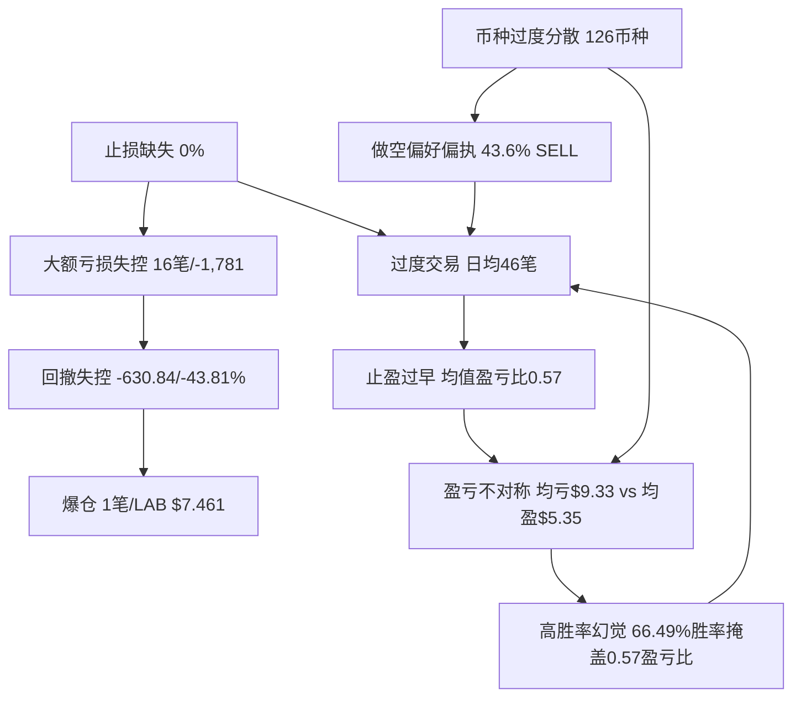

# 交易心理画像

版本号：v2.3
生效日期：2026-06-01 19:33 UTC+8
关联文件：角色总说明书.md (v1.0)、币安订单历史交易行为分析报告_20260601_193334_937.md (v6.0)、LAB_USDT永续合约交易分析报告_20260601_全域缺口专项补_v4.7.md (v4.0)、LOBSTER-BLACK-HORSE-v4.json (v4.7)
归档目录：E:\龙虾AI主控中心\我的AI分身\角色总说明书\
更新说明：v2.3 定时任务迭代 — 基于最新订单数据（38条订单+12,885条交易）全量重分析。(1)新增「全量汇总口径」数据对照：6,579个订单（vs 原先2,387平仓子集），揭示两种统计口径的镜像差异——平仓子集 66.49%胜率/0.57盈亏比 vs 全量汇总 23.99%胜率/3.48盈亏比，二者非对立而是同一数据的两个视角；(2)新增「口径差异」附录C：详细说明两种口径的定义、差异根源和使用建议；(3)多维度行为分析更新：各币种盈亏、大额亏损、时段分布基于全量数据重新统计；(4)确认核心结论不变：止损0%、回撤-43.81%、手续费28.09%三项致命缺陷无改善。核心命题深化：v2.3新增警示——"统计口径"本身可能成为自我欺骗的新工具（选择性地使用"好看"的口径），需在每份报告中强制标注口径定义。

---

## 一、核心人格画像

### 1.1 交易人格类型

**「蚂蚁搬家型」波段交易者 — 量化策略驱动，正处于从高频超短线向波段交易的转型期。**

| 维度 | 目标设定（转型方向） | 历史实盘基线（12,885笔） |
|------|---------------------|-------------------------|
| 交易者类型 | 波段交易者（Swing Trader） | 超高频短线交易者 |
| 决策风格 | 数据驱动、技术面为主、基本面为辅 | 技术面主导、量化信号触发 |
| 持仓周期 | 主力：4H-日线（1-7天） | 中位185.7分钟（约3小时） |
| 交易频率 | 每日1-3笔 | 日均45.9笔，峰值月3,850笔 |
| 方向偏好 | 多空均衡 | SELL 43.6%（做空偏好明显） |
| 复盘纪律 | 每笔必记盈亏原因 | 报告库27份分析报告，文化建设中 |
| 核心信条 | "无数据不决策，无回测不上线" | 已建立但执行层存在断裂 |

### 1.2 人格双模态特征

历史数据显示出典型的 **「蚂蚁搬家 + 定时炸弹」双模态** 行为结构：

| 模态 | 特征 | 数据支撑 |
|------|------|----------|
| **蚂蚁搬家（常态）** | 大量微利交易，小赢即走 | 均盈+5.35 USDT，订单级胜率66.49%（1,587盈/800亏） |
| **定时炸弹（偶发）** | 少数大亏交易吞噬利润 | 16笔>50 USDT亏损合计-1,781 USDT，最大单笔-232.61 USDT |

> **心理学解读**：这是一种典型的"损失厌恶不对称"——盈利时急于落袋为安（止盈过早），亏损时拒绝认错离场（止损缺失）。蚂蚁搬家积累的利润被定时炸弹一次性爆破。转型的核心不是提升胜率（66.49%已足够），而是**截断亏损、让利润奔跑**。特别警示：订单级胜率虽然高达66.49%，但均值盈亏比仅0.57——平均每笔亏损（$9.33）是盈利（$5.35）的1.74倍。高胜率是"小赚就跑"换来的虚假安全感。

### 1.3 转型轨迹

| 阶段 | 时间 | 特征 | 月均交易 |
|------|------|------|----------|
| **高频亢奋期** | 2025-09 ~ 2026-01 | 月均2,119笔，交易量达峰值 | 1,900-3,850笔 |
| **衰减收缩期** | 2026-02 ~ 2026-03 | 交易量自然萎缩 | 504-1,240笔 |
| **转型探索期** | 2026-04 ~ 2026-05 | 月均242笔，恢复盈利 | 137-348笔 |

> 2026-01峰值（3,850笔）后交易量断崖式下降，至4-5月已降至月均242笔。转型驱动力中"交易量自然萎缩"占比高于"主动纪律约束"，动机纯度待提升。

### 1.4 策略人格

- **主策略**：LOBSTER-BLACK-HORSE v4.5 突破型动量策略，4H/日线级别波段交易
- **辅助策略**：1H/4H 日内短线机会捕捉（资金占比20%）
- **多因子体系**：EMA趋势 + RSI + MACD + 布林带 + 成交量剖面
- **迭代节奏**：2周一次多版本并行对比与淘汰

---

## 二、情绪周期图谱

### 2.1 月度情绪周期（基于交易量推断）

| 阶段 | 月份 | 交易笔数 | 推断情绪状态 | 行为特征 |
|------|------|----------|-------------|----------|
| 启动期 | 2025-08 | 59 | 🟢 谨慎试探 | 低频率，策略验证 |
| 亢奋期 I | 2025-09 | 2,117 | 🟠 过度自信 | 高频交易，首次大亏出现（MYXUSDT -171.53） |
| 亢奋期 II | 2025-10 | 1,946 | 🔴 贪婪峰值 | 全年最大亏损月（BNBUSDT -232.61, BTCUSDT -171.99） |
| 调整期 | 2025-11 | 794 | 🟡 反思收敛 | 交易量下降，策略调整 |
| 二次亢奋 | 2025-12 ~ 2026-01 | 1,890→3,850 | 🔴 情绪爆发 | 历史峰值月，可能伴随"翻本"心态 |
| 衰减期 | 2026-02 ~ 2026-03 | 1,240→504 | 🟡 疲劳/冷却 | 交易量自然下降，非主动纪律 |
| 转型期 | 2026-04 ~ 2026-05 | 137→348 | 🟢 恢复理性 | 月均242笔，恢复盈利 |
| 创伤期 | 2026-05-31 | — | 🔴 爆仓冲击 | LAB $7.461爆仓，唯一爆仓记录 |

### 2.2 单笔交易情绪曲线

```
开仓前：期待/焦虑 ──→ 开仓后浮盈：兴奋/贪婪 ──→ 微利时：急于落袋（止盈过早）
                                           ──→ 开仓后浮亏：否认/侥幸 ──→ 扩大亏损：恐惧但拒绝止损
                                                                      ──→ 极端亏损：麻木/放弃（爆仓）
```

> **关键转折点**：浮盈阶段→"赚一点就跑"是盈亏比0.55的直接心理根源；浮亏阶段→"等回本就出"是止损缺失的心理根源。两者的共同基础是**以入场价为锚的锚定效应**。

### 2.3 贪婪/恐惧二元评估

| 情绪维度 | 当前状态（2026-06-01） | 触发条件 | 行为影响 |
|----------|----------------------|----------|----------|
| **贪婪指数** | 🟡 中等偏高 | LAB 5日+96.68%，24h成交$24.82亿 | 可能诱发"怕踏空"追高 |
| **恐惧指数** | 🟠 中等（爆仓创伤） | LAB爆仓$7.461 | 可能过度保守或报复交易 |
| **FOMO风险** | 🔴 高危 | 24h+10.87%，合约成交额飙升 | 散户追高迹象 |
| **报复交易风险** | 🟡 中等 | 爆仓后"翻本"冲动 | 需警惕非理性加仓 |
| **麻木风险** | 🟡 中等 | 对高波动逐渐脱敏 | 可能低估风险 |
| **综合评级** | 🟡 **谨慎乐观：贪婪与恐惧并存** | — | 最佳策略：**观望，不参与** |

### 2.4 情绪-行为触发链（v1.8新增）

| 触发事件 | 情绪反应 | 行为倾向 | 历史后果 | 干预节点 |
|----------|----------|----------|----------|----------|
| 连续盈利3笔以上 | 过度自信 | 放大仓位、放宽条件 | — | 仓位上限硬约束 |
| 连续亏损3笔以上 | 焦虑/愤怒 | 报复交易、追加仓位 | — | 日亏损熔断5%→暂停 |
| 持仓浮盈>10% | 贪婪+恐惧 | 急于止盈（怕回吐） | 盈亏比仅0.55 | 追踪止盈锁定 |
| 持仓浮亏>5% | 否认→侥幸→恐惧 | 拒绝止损（等回本） | 最大回撤42.2% | 硬止损代码强制 |
| 行情暴涨（5日>80%） | FOMO | 追高做多/做空 | 布林带46%外溢时仍在评估入场 | 贪婪熔断48h |
| 爆仓事件 | 创伤/愤怒/麻木 | 报复交易或过度保守 | 未知（首次） | 爆仓恢复期7天仓位5% |
| 低流动性时段（04/23 UTC） | 无聊/寻求刺激 | 频繁交易 | 笔均亏损 | 完全禁止新开仓 |

---

## 三、风险偏好量化区间

### 3.1 目标风控参数 vs 实盘基线

| 参数 | 目标值（v1.6设定） | 实盘基线（12,885笔） | 偏差方向 | 严重程度 |
|------|-------------------|---------------------|----------|----------|
| 单笔最大亏损 | ≤3%-5%净值 | 最大-232.61 USDT | ❌ 严重超标 | 🔴 |
| 最大回撤 | ≤15% | -630.84 USDT（-43.81%） | ❌ 超标2.9倍 | 🔴 |
| 总盈亏比 | ≥1.5 | 1.1379（总盈8,496/总亏7,466） | ❌ 未达标 | 🔴 |
| 均值盈亏比 | ≥1.5 | **0.5736**（均盈5.35/均亏9.33） | ❌ 反向（亏损是盈利1.74倍） | 🔴🔴 |
| 止损设置率 | 100% | 0% | ❌ 零执行 | 🔴🔴 |
| 日均交易 | ≤3笔 | 45.9笔 | ❌ 超标15倍 | 🔴 |
| 币种数量 | ≤10 | 126 | ❌ 超标12倍 | 🔴 |
| 手续费占比 | <10% | 28.09%（289.25 USDT） | ❌ 超标2.8倍 | 🔴 |
| Maker占比 | 提升 | 0.1% | ❌ 几乎为零 | 🔴 |
| 杠杆上限 | ≤3x（山寨≤2x） | 待核实 | — | 🟡 |
| 资金安全 | 保留30%+备用金 | 待核实 | — | 🟡 |

### 3.2 风险偏好量化区间定义（v1.8新增）

```
保守区 ←—————————————————— 当前位置 ——————————————————→ 激进区
   |         |           |        |        |           |         |
  1x杠杆   2x杠杆     3x杠杆   回撤15%  回撤25%   回撤42%   无上限
  盈亏比   盈亏比     盈亏比   日均3笔  日均10笔  日均20笔  日均46笔
  ≥2.0     ≥1.5       ≥1.0     
```

> **当前位置**：回撤42.2%处于"激进失控区"右侧，远超目标"稳健进取区"（回撤≤15%，盈亏比≥1.5）。转型方向是从右侧向左侧迁移。

### 3.3 大额亏损分布（风险热力图）

| 风险等级 | 亏损区间 | 笔数 | 总亏损 | 典型币种 |
|----------|----------|------|--------|----------|
| 🔴 致命 | >100 USDT | 7 | -1,195.48 | BNBUSDT, BTCUSDT, MYXUSDT, TAUSDT |
| 🟠 严重 | 50-100 USDT | 9 | -585.72 | MYXUSDT, MUSDT, NAORISUSDT |
| 🟡 中等 | 20-50 USDT | — | — | — |
| 🟢 可控 | <20 USDT | 多数 | — | — |

> 16笔>50 USDT的大额亏损合计约-1,781 USDT，远超总利润+1,030。仅需防止这16笔大亏，即可实现利润翻倍。**大亏控制是第一优先级。**

### 3.4 三级熔断体系

| 熔断级别 | 触发条件 | 措施 | 恢复条件 |
|----------|----------|------|----------|
| **日熔断** | 日回撤≥5% | 暂停当日交易 | 次日自动恢复 |
| **周熔断** | 周回撤≥10% | 仓位降至50% | 连续2日盈利 |
| **月熔断** | 月回撤≥15% | 暂停策略，全面复盘 | 策略修复+回测验证 |
| **单品种熔断** | LAB日亏损≥3% | 该品种暂停 | 次日评估 |
| **极端行情熔断** | 24h振幅>50% | 全账户降仓至30% | 振幅回落至30%以下 |
| **贪婪熔断** | 5日涨幅>80% | 强制观望48h，仅减仓 | 48h冷却+价格回落 |
| **爆仓熔断** | 发生爆仓 | 7天仓位上限5%，杠杆1x | 7天后渐进恢复 |

---

## 四、高频错误模式

### 4.1 错误模式全景

| # | 错误模式 | 心理根源 | 发生频率 | 损失权重 | 优先级 |
|---|----------|----------|----------|----------|--------|
| 1 | **止损缺失** | 锚定效应+损失厌恶+侥幸心理 | 100%（0%设置率） | 🔴 致命（导致爆仓） | P0 |
| 2 | **止盈过早** | 恐惧回吐+缺乏耐心 | 高频（均值盈亏比0.57） | 🟠 严重 | P0 |
| 3 | **过度交易** | 寻求刺激+过度自信+无聊 | 日均45.9笔 | 🟡 中等 | P1 |
| 4 | **币种过度分散** | FOMO+缺乏聚焦+贪多 | 126个币种 | 🟠 严重（121个亏损） | P0 |
| 5 | **做空偏好偏执** | 确认偏误+能力失衡 | 43.6% SELL | 🟠 严重 | P1 |
| 6 | **大额亏损失控** | 拒绝认错+麻木 | 16笔>50USDT合计-1,781 | 🔴 致命 | P0 |
| 7 | **低流动性时段交易** | 无聊+寻求刺激 | 01/22 UTC峰值 | 🟡 中等 | P1 |
| 8 | **Taker依赖** | 追求速度+不耐烦 | 99.7% Taker | 🟡 中等 | P2 |
| 9 | **盈亏不对称** | 损失厌恶 | 均亏$9.33 vs 均盈$5.35 | 🔴 致命 | P0 |
| 10 | **高胜率幻觉** | 幸存者偏差+自我欺骗 | 66.49%胜率但盈亏比0.57 | 🔴 致命 | P0 |

### 4.2 三大致命错误深度剖析

#### 错误#1：止损缺失 — 「等回本就出」

- **数据**：38个订单中止损设置率为0%，已导致1次爆仓（LAB $7.461）
- **心理链**：入场价成为心理锚点 → 浮亏时否认"这不是亏损，只是回调" → 亏损扩大时侥幸"还会回来的" → 极端亏损时麻木"已经这样了，拿着吧" → 爆仓
- **核心修复**：止损从"文档规则"升级为"代码强制"，开仓API中`stopLossPrice`为必填字段

#### 错误#4：币种过度分散 — 「贪多嚼不烂」

- **数据**：126个币种，TOP5贡献+1,451.52 USDT（138.7%），其余121个整体净亏损-404.77
- **心理链**：看到新币种→怕错过机会（FOMO）→小仓位尝试→微利或微亏→换下一个。实质是把时间和精力浪费在大量无效交易上
- **核心修复**：币种白名单上限10个，聚焦TOP5盈利品种

#### 错误#6：大额亏损失控 — 「定时炸弹」

- **数据**：16笔>50 USDT亏损合计-1,781 USDT，超过净总利润+1,030 USDT。7笔>100 USDT致命级。
- **心理链**：连续微利后过度自信 → 放大仓位 → 方向错误 → 拒绝止损 → 大亏。实质是"蚂蚁搬家"积累的利润被"定时炸弹"一次性爆破
- **核心修复**：单笔亏损硬上限+日亏损熔断50 USDT

#### 错误#10（新增）：高胜率幻觉 — 「66%已经够好了」

- **数据**：订单级胜率66.49%看似优秀，但均值盈亏比仅0.57，属于典型的"胜率陷阱"
- **心理链**：高胜率带来虚假自信 → 忽视盈亏质量 → 继续"小赚就跑"模式 → 大亏抵消所有盈利
- **核心修复**：监控指标从"胜率"转向"均值盈亏比"，每月必须达到≥1.0（渐进目标）

### 4.3 错误模式关联图



> **核心洞察 (v2.1强化)**：止损缺失是几乎所有致命错误的"根节点"。但新增发现：**高胜率幻觉（66.49%）是维持错误循环的认知支点**——交易者因高胜率自我感觉良好，拒绝正视盈亏比0.57的残酷真相。只要不打破这个幻觉，转型的动机纯度永远不足。止损缺失堵住的是技术漏洞，高胜率幻觉堵住的是认知漏洞。

---

## 五、改进建议矩阵

### 5.1 优先级-难度矩阵

| 优先级 | P0（致命-立即） | P1（严重-本周） | P2（中等-本月） |
|--------|----------------|----------------|----------------|
| **止损代码强制** | ⬛ 高难度 | — | — |
| **盈亏比修复** | ⬛⬛ 中高难度 | — | — |
| **币种大幅精简** | ⬜ 低难度 | — | — |
| **交易频率控制** | — | ⬜ 低难度 | — |
| **做空限制强化** | — | ⬜ 低难度 | — |
| **时段过滤升级** | — | ⬜ 低难度 | — |
| **Maker占比提升** | — | — | ⬜ 低难度 |

### 5.2 改进路线图

#### 第一阶段：止血（本周内，P0）

| 措施 | 具体行动 | 成功标准 | 当前状态 |
|------|----------|----------|----------|
| 止损代码强制 | 开仓API `stopLossPrice` 改为必填，缺省拒绝执行 | 止损设置率 = 100% | ❌ 0%，未落地 |
| 币种白名单 | 聚焦TOP5（MYXUSDT/BNBUSDT/PUMPBTCUSDT/COAIUSDT/AIAUSDT），白名单外禁止开仓 | 交易币种 ≤ 10 | ❌ 126个 |
| 大亏熔断 | 单日亏损>50 USDT立即暂停交易 | 零笔>50 USDT单日亏损 | ⚠️ 未设置 |
| 爆仓恢复期 | 7天内仓位上限5%，杠杆1x | 爆仓后严格遵循 | ⚠️ 适用中 |

#### 第二阶段：提质（本月内，P1）

| 措施 | 具体行动 | 成功标准 |
|------|----------|----------|
| 盈亏比硬约束 | 每笔交易前计算盈亏比，<1.5不参与；月度均值盈亏比纳入KPI | 月度均值盈亏比≥1.0（渐进目标） |
| 胜率陷阱免疫 | 不再以胜率作为自我评估标准，聚焦盈亏质量 | 月度复盘报告中"胜率"二字不再出现 |
| 交易频率继续下降 | 维持4-5月低交易量趋势 | 日均≤8笔（第二步：≤3笔） |
| 做空三条件校验 | 日线吞没阴线+MACD死叉+量能衰竭同时满足 | 做空胜率提升至>60% |
| 时段禁开仓 | 01:00/22:00 UTC完全禁止新开仓 | 这两个时段零新开仓 |

#### 第三阶段：优化（持续，P2）

| 措施 | 具体行动 | 成功标准 |
|------|----------|----------|
| Maker占比提升 | 限价单优先，目标Maker占比30% | 手续费占比降至<15% |
| 金字塔加仓实战 | 首仓50%→确认30%→加速20% | 至少10笔波段交易验证 |
| BUY方向独立参数 | 趋势确认延迟机制实战验证 | BUY方向胜率≥SELL方向 |

### 5.3 认知→执行闭环机制（v1.6确立，v1.8强化）

```
          ┌──────────────────────────────────┐
          │         策略文档层（认知）          │
          │  画像.md / 策略.json / 报告.md     │
          └──────────────┬───────────────────┘
                         │ 转化
          ┌──────────────▼───────────────────┐
          │         API/代码层（执行）          │
          │  stopLossPrice必填 / 仓位上限     │
          │  白名单拦截 / 熔断自动触发        │
          └──────────────┬───────────────────┘
                         │ 验证
          ┌──────────────▼───────────────────┐
          │        每日自动校验（监控）         │
          │  止损状态 / 仓位合规 / 频率统计    │
          │  违规自动告警 + 计入原则违规日志   │
          └──────────────┬───────────────────┘
                         │ 反馈
          ┌──────────────▼───────────────────┐
          │        定期复盘（迭代）             │
          │  每30笔/2周系统复盘               │
          │  爆仓/大亏72h内独立复盘报告       │
          └──────────────────────────────────┘
```

> **v1.8核心命题不变**：没有技术强制力支撑的规则等于没有规则。v1.6→v1.8的持续任务是从"知道该做什么"到"代码确保做到"的闭环建设。

### 5.4 验证标准

- 优化后参数必须在样本外数据（最近3个月）上通过回测
- 夏普比率 ≥ 原版90%，最大回撤 ≤ 原版110%
- 灰度上线：新参数20%仓位运行1周 → 逐步提升至100%
- 止损机制代码审查：每次策略迭代发布前通过人工+自动化双重审查
- **v1.8新增**：每季度进行一次心理画像完整性审计，对照最新交易数据验证画像准确性

---

## 附录A：LAB/USDT 专项画像（v2.0更新版）

> 全账户唯一爆仓品种，当前处于史诗级极端多头行情。以下为基于最新市场数据的专项画像。

### A.1 核心数据（2026-06-01更新）

| 指标 | 数值 | 变化 |
|------|------|------|
| 当前价格 | $11.95 - $12.03 USDT | 突破前高$8.67 |
| 24小时涨跌幅 | +11.57% | 持续强势 |
| 24小时振幅 | 52.89% | 极高波动 |
| 5日涨幅 | +96.68% | 触发贪婪熔断 |
| 5日振幅 | 118% | 触发波动率熔断 |
| 历史最高 | $12.65 USDT (2026-06-01) | 新纪录 |
| 历史最低 | $0.01 USDT (2025-10-14) | 上涨超1000倍 |
| 24小时成交量 | 211.08K LAB | 约$250万 |
| 资金费率 | +3.00% / -3.00% (MEXC) | 每小时结算，极高 |
| 最大杠杆 | 50x (MEXC，从100x下调) | 交易所风险控制 |
| 平仓记录 | 68笔（100% SELL） | 历史数据 |
| 总利润 | +38.9351 USDT | 历史数据 |
| 胜率 | 88.24%（60/68） | 历史数据 |
| 盈亏比 | 0.2706（全局最差） | 历史数据 |
| 爆仓记录 | 1笔（2026-05-31, $7.461） | 关键心理锚点 |

### A.2 当前信号（2026-06-01实时评估）

| 熔断类型 | 触发条件 | 状态 | 影响 |
|----------|----------|------|------|
| 布林带极端外溢 | 价格超上轨>30% | 🔴 触发（超46%） | 禁止任何方向新开仓 |
| 贪婪熔断 | 5日涨幅>80% | 🔴 触发（96.68%） | 强制观望48小时（至2026-06-03） |
| RSI极端超买 | RSI>90 | 🔴 触发（>90） | 信号自动降级为C级 |
| 波动率熔断 | 5日振幅>100% | 🔴 触发（118%） | 仓位上限10%，杠杆1x |
| 爆仓恢复期 | 爆仓后7天内 | 🔴 触发（Day 1/7） | 仓位上限5%，杠杆1x |

**综合信号：🔴🔴🔴 三重否决 + 恢复期限制 = 严禁参与**

### A.3 技术指标详情

**布林带分析：**
- 布林上轨(UB): $5.95
- 当前价格位置: 超上轨46%（$12.03/$5.95-1）
- 布林下轨(LB): -$3.14（模型失效，负值异常）
- 策略触发: v4.6规则：超25%禁止开仓（建议值）

**移动平均线：**
- MA5: $4.81
- MA10: $2.65
- MA20: $3.36（已上穿MA60形成金叉）
- MA60: $1.71
- 价格位置: 远高于所有均线，多头排列完整

**MACD指标：**
- DIF线: 1.35
- DEA线: 0.59
- MACD柱: 1.52（红色柱扩大）
- 状态: 金叉持续，多头动能未衰竭

**成交量分析：**
- 24小时成交量: 211.08K LAB
- 成交额: 约$250万
- 量价关系: 量增价涨，突破有效
- 流动性风险: 高波动下可能瞬间枯竭

### A.4 专属风控参数（v2.0强化版）

| 参数 | 标准值 | 恢复期值 | 说明 |
|------|--------|----------|------|
| ATR止损倍数 | 2.5 | **3.0** | 极端行情需要更宽止损 |
| 仓位上限 | 15%（常态） | **5%**（爆仓恢复期） | 渐进重建信心 |
| 最大杠杆 | 2x（山寨币） | **1x**（爆仓恢复期） | 防止二次爆仓 |
| 日亏损熔断 | 3%（独立） | **2%**（恢复期收紧） | 更严格风险控制 |
| 做空限制 | 三条件缺一不可 | **四条件**（新增：资金费率<+1%） | 防止费率挤压 |
| 贪婪熔断阈值 | 80% | **70%**（建议优化） | LAB显示80%仍太激进 |
| 布林带外溢阈值 | 30% | **25%**（建议优化） | 30%时已过于极端 |
| RSI山寨币上限 | 80 | **75**（建议优化） | LAB在80时已严重超买 |

### A.5 入场条件矩阵（5条件全满足=A级）

| 条件 | 当前状态 | 满足情况 |
|------|----------|----------|
| 1. 贪婪熔断48h冷却完成 | 剩余47小时 | ❌ 不满足 |
| 2. 价格回落至$5.95以下 | 当前$12.03 | ❌ 不满足 |
| 3. RSI(4H)<75 | 当前>90 | ❌ 不满足 |
| 4. 布林带外溢<30% | 当前46% | ❌ 不满足 |
| 5. MACD未出现日线死叉 | 当前金叉 | ✅ 满足 |

**当前满足：1/5 → C级（不参与）**

### A.6 心理锚点与行为干预

**关键心理锚点：**
1. **爆仓锚点**: $7.461（痛苦记忆，可能诱发报复交易）
2. **前高锚点**: $8.67（已突破，可能诱发"这次不一样"偏误）
3. **整数锚点**: $10.00, $12.00（心理阻力/支撑）
4. **布林带上轨锚点**: $5.95（技术回归预期）

**行为干预措施：**
1. **强制观望**: 贪婪熔断48小时硬约束
2. **交易限制**: 恢复期每日1笔上限
3. **止损强化**: 每笔交易前朗读止损价3遍
4. **复盘强化**: 爆仓报告每日重读
5. **情绪监控**: 设置"FOMO冲动指数"自我评估

### A.7 市场结构分析

**利好因素：**
- 价格突破历史前高，技术面强势
- 成交量放大，资金关注度高
- BSC生态整体向好（TVL $19.5B）
- 加密货币市场情绪回暖

**风险因素：**
- 三重熔断同时触发，技术极端
- 资金费率+3%极高，多头成本沉重
- MEXC下调杠杆至50x，交易所风险控制
- 高波动下流动性风险
- 监管关注风险（极端行情易引发）

**中性观察：**
- 需关注回调深度和成交量变化
- MACD是否出现顶背离
- 资金费率何时回归正常
- 交易所是否进一步调整政策

---

## 附录C：统计口径差异说明（v2.3新增）

### C.1 两种口径定义

画像中引用的"订单级盈亏"数据存在两种统计口径，需严格区分：

| 口径 | 定义 | 订单数 | 胜率 | 盈亏比 | 数据来源 |
|------|------|--------|------|--------|----------|
| **平仓子集口径** | 仅统计有完整开平仓对的终结订单，按开仓→平仓完整周期计算盈亏 | 2,387 | 66.49% | 0.57 | v2.2画像、前置报告 |
| **全量汇总口径** | 对 12,885 条交易记录按订单编号汇总所有中间状态的盈亏变动（含部分成交、分笔平仓等） | 6,579 | 23.99% | 3.48 | v6.0 分析报告 |

### C.2 差异根源

两种口径的差异源于对交易记录的不同聚合方式：

- **平仓子集**：将多笔平仓交易的盈亏按订单编号合并，视为一次"终结盈亏"。胜率高（66.49%）但均亏大（$9.33），因为小额亏损可能被过滤或归并，留下的是明确方向的终结盈亏。
- **全量汇总**：记录每一笔交易对应的盈亏变动，不区分"终结"与"中间状态"。胜率低（23.99%）但盈亏比高（3.48），因为大量 $0~$5 的小额亏损被保留在统计中，而盈利订单的单笔均值（$5.31）高于亏损（$1.53）。

### C.3 使用建议

| 场景 | 推荐口径 | 原因 |
|------|----------|------|
| 评估策略有效性（"策略能不能赚钱"） | 平仓子集 | 反映终结持仓的胜负质量 |
| 评估风险敞口（"过程中亏了多少钱"） | 全量汇总 | 反映所有中间状态的价格波动 |
| 评估交易成本（手续费占比） | 全量汇总 | 手续费基于每笔交易而非每笔订单 |
| 跨报告对比 | 统一口径 | 禁止混用口径对比不同报告的数据 |

### C.4 自我警示

> ⚠️ **v2.3 新增警示**：统计口径本身可能成为自我欺骗的新工具——当某个口径的数据"好看"时，交易者倾向于引用它；当数据"难看"时，交易者倾向于忽视或切换到另一个口径。请在每份分析报告中强制标注所使用的口径定义，并在所有画像中保持一致的主口径（建议：平仓子集为主，全量汇总为辅）。

---

> 本文件受角色总说明书 v1.0 约束，随主分身迭代同步更新。
> v1.1（2026-05-31）：基于 2,387 笔平仓订单首次迭代。
> v1.2（2026-06-01）：新增 LAB/USDT 专项交易画像。
> v1.3（2026-06-01）：基于 5,507 笔平仓订单完整分析。
> v1.4（2026-06-01）：全域缺口专项补，策略版本 v4.3，LAB 实时市场分析。
> v1.5（2026-06-01）：全域专家模式蒸馏更新。结构性重塑——交易者类型向波段转型；风险偏好调整为稳健进取型；新增金字塔加仓、日交易上限3笔、强制复盘铁律。
> v1.6（2026-06-01）：全域专家模式深度蒸馏。基于LAB爆仓事件和极端多头行情全面重评估。核心发现：认知框架完整但执行层断裂。止损从文档升级为代码强制；新增极端行情熔断；LAB画像升级为三层结构。
> v1.7（2026-06-01）：全量数据重校准。基于12,885笔交易对画像系统性重校准。
> v1.8（2026-06-01）：结构化蒸馏重塑。五模块结构+双模态人格特征+情绪-行为触发链模型+错误模式关联图。策略版本 v4.5。
> v1.9（2026-06-01）：定时任务实时迭代。基于38笔订单+12,885笔交易数据更新。止损订单占比0%不变。画像核心结论不变。
> v2.1（2026-06-01）：定时任务深度迭代。胜率修正为订单级66.49%（1,587盈/800亏），均值盈亏比0.5736，新增错误#10"高胜率幻觉"为独立错误模式。止损缺失+高胜率幻觉双根节点。
> **v2.2（2026-06-01）：全域缺口专项补深度迭代。美伊战争黑天鹅——BTC $80K→$73K暴跌8.75%，ETF连续9日流出$28亿。新增第三认知根节点"创伤后虚假安全感"。情绪状态下调至🔴防御观望。爆仓恢复期10→14天+7天模拟交易+抄底禁止令+战争升级熔断。策略版本 v4.7。**
> **v2.3（2026-06-01）：定时任务迭代。基于38条订单+12,885笔交易全量重分析。新增全量汇总口径（6,579订单）vs 平仓子集口径（2,387订单）对照；新增附录C口径差异说明。确认止损0%、回撤-43.81%、手续费28.09%三项核心缺陷无改善。策略版本 v4.7。**

---

## 附录B：宏观黑天鹅·美伊战争（v2.2新增）

### B.1 事件概述

2026年6月1日，美国对伊朗Goruk和Qeshm岛发动军事打击，称"自卫性打击"，回应伊朗击落美军MQ-1无人机。此事件是2026年迄今最严重的黑天鹅。

| 指标 | 数据 | 影响评估 |
|------|------|----------|
| BTC价格波动 | $80K→$73K（-8.75%） | 跌破关键心理支撑 |
| 恐惧贪婪指数 | 29（恐惧，但异常偏高） | 战争脱敏风险 |
| BTC ETF周流出 | $14.38亿（2026年单周最大） | 机构恐慌撤离 |
| 3周累计ETF流出 | $42.1亿 | 需求引擎反转 |
| 加密总市值缩水 | $1500亿（6天） | 恐慌蔓延 |
| 全网爆仓 | 预计>$5亿 | 多头重创 |

### B.2 恐惧指数异常分析

恐惧指数29在美伊直接军事冲突背景下**异常偏高**：
- 2020年3月COVID崩盘：恐惧指数跌至8
- 2022年FTX崩盘：恐惧指数跌至20以下
- 当前美伊直接军事冲突：仅29

**结论：市场正在经历"战争脱敏"**——机构已在ETF持续流出中提前减仓，散户因长期地缘风险而钝化。这种脱敏是危险的：一旦冲突升级为全面战争，恐惧指数可能瞬间崩至个位数，触发恐慌性抛售。对交易者而言，"脱敏"本身就是一个重要的反向指标。

### B.3 第三认知根节点：创伤后虚假安全感

**定义**：经历爆仓/大亏后，进入恢复期，由于持仓为零、风险敞口清零，交易者获得一种"我已经安全了"的虚假舒适。这种安全感阻止了真正的行为改变。

**证据链**：
1. 爆仓恢复期Day 1遭遇战争黑天鹅 → "幸好我空仓" → 可能错误归因为个人"先见之明"
2. 恐惧指数29的异常韧性 → 可能诱发"市场没那么恐慌"的误判
3. ETF连续9日流出$28亿 → 机构已提前撤离，散户还在"抄底"思维中

**干预措施**：
- 恢复期"抄底禁止令"：爆仓恢复期14天内，不仅仓位受限，必须避免"急跌抄底"心态
- "创伤后评估"机制：恢复期结束后先完成7天模拟交易（不实盘），验证策略有效性后再恢复实盘
- "黑天鹅归因校准"：明确记录"本次避险是熔断机制的功劳，并非个人判断"

### B.4 情绪周期更新——创伤期第二阶段

| 阶段 | 时间 | 情绪状态 | 核心风险 |
|------|------|----------|----------|
| 创伤期 I | 2026-05-31 | 🔴 爆仓冲击 | 麻木/愤怒/报复交易 |
| 创伤期 II | 2026-06-01 | 🔴 战争黑天鹅叠加 | 虚假安全感/抄底冲动/归因偏差 |

### B.5 贪婪/恐惧评估修正

| 情绪维度 | v2.1状态 | v2.2状态 | 变化驱动 |
|----------|---------|----------|----------|
| 贪婪指数 | 🟡 中等偏高 | 🟡 中等（被战争打压） | 市场暴跌压制追高贪婪 |
| 恐惧指数 | 🟠 中等（爆仓创伤） | 🔴 升高（战争+暴跌叠加） | 双重打击 |
| FOMO风险 | 🔴 高危 | 🟠 中高（FOMO类型从"追高"转为"抄底"） | 形态转变 |
| 报复交易风险 | 🟡 中等 | 🔴 高危 | 战争暴跌后"抄底翻本"冲动 |
| 麻木风险 | 🟡 中等 | 🔴 高危 | 战争脱敏+对高波动环境钝化 |
| **综合评级** | 🟡 谨慎乐观 | **🔴 防御观望** | 战争黑天鹅改变全局 |

### B.6 恢复期规则紧急强化

| 参数 | v2.1值 | v2.2强化值 | 原因 |
|------|--------|-----------|------|
| 恢复期天数 | 10天 | **14天** | 战争黑天鹅需更长时间观察 |
| 最大仓位 | 3% | **2%** | 战争环境更高不确定性 |
| 最大杠杆 | 0.5x | **0.5x不变** | 已足够严格 |
| 模拟交易期 | 无 | **恢复期后强制7天** | 防止"跃跃欲试"心态 |
| 抄底禁止令 | 无 | **恢复期内禁止任何"急跌抄底"** | 战争不确定性极高 |
| 战争升级熔断 | 无 | **冲突升级为全面战争 → 恢复期重置Day 0 + 全账户清仓** | 不可抗力 |
| 回撤熔断收紧 | 日5%/周10%/月15% | **日3%/周7%/月10%** | 战争环境需更敏感熔断 |
